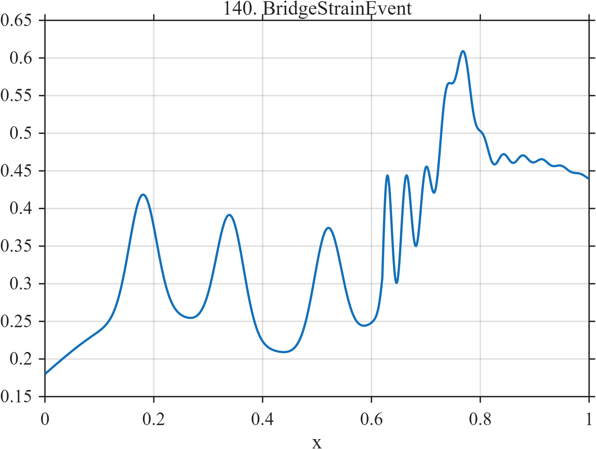

# TF140 — BridgeStrainEvent

## Overview

The **BridgeStrainEvent** signal combines slow thermal drift, four repeated vehicle-load-like responses, a small slip transition, and damped structural vibration.

## Mathematical Definition

Let $S(x;c,w)=[1+e^{-(x-c)/w}]^{-1}$, $g(x;c,w)=e^{-((x-c)/w)^2/2}$, and $u=(x-0.62)_+$. Then

$$
\begin{aligned}
f(x)={}&0.18+0.16x+0.05\sin(3\pi x)
+0.16\sum_{c\in\{0.18,0.34,0.52,0.76\}}g(x;c,0.025)\\
&+0.10S(x;0.62,0.004)+0.10I(x\ge0.62)e^{-12u}\sin(2\pi\,28u).
\end{aligned}
$$

## Morphological Characteristics

| Property | Description |
|---|---|
| Primary family | Drift, repeated loads, slip, and damped vibration |
| Load responses | Four broad positive events |
| Structural event | Slip and ringing beginning near $x=0.62$ |
| Main challenge | Distinguishing local structural change from ordinary drift |

## Parameters

| Parameter | Meaning | Default |
|---|---|---:|
| $0.16$ | Vehicle-load amplitude | 0.16 |
| $0.10$ | Slip magnitude | 0.10 |
| $12,28$ | Ringing decay and cycle frequency | As shown |

## MATLAB Implementation

~~~matlab
N=1024; x=linspace(0,1,N); S=@(z,c,w) 1./(1+exp(-(z-c)/w));
f=0.18+0.16*x+0.05*sin(2*pi*1.5*x);
for c=[0.18 0.34 0.52 0.76], f=f+0.16*exp(-0.5*((x-c)/0.025).^2); end
u=max(x-0.62,0);
f=f+0.10*S(x,0.62,0.004)+(x>=0.62).*0.10.*exp(-12*u).*sin(2*pi*28*u);
plot(x,f); grid on; title('TF140 — BridgeStrainEvent')
exportgraphics(gcf,'TF140_BridgeStrainEvent.png','Resolution',300);
~~~

## Python Implementation

~~~python
import numpy as np
import matplotlib.pyplot as plt
N=1024; x=np.linspace(0,1,N); S=lambda c,w: 1/(1+np.exp(-(x-c)/w))
f=.18+.16*x+.05*np.sin(2*np.pi*1.5*x)
for c in [.18,.34,.52,.76]: f+=.16*np.exp(-.5*((x-c)/.025)**2)
u=np.maximum(x-.62,0); f+=.10*S(.62,.004)+(x>=.62)*.10*np.exp(-12*u)*np.sin(2*np.pi*28*u)
plt.plot(x,f); plt.grid(alpha=.3); plt.tight_layout()
plt.savefig('TF140_BridgeStrainEvent.png',dpi=300)
~~~

## Recommended Uses

- Structural-health-monitoring denoising
- Slip-event localization
- Drift and vibration separation

## Provenance

**Status:** Bridge-strain-monitoring-inspired deterministic surrogate.

---

[← Previous: TerahertzLayerEcho](TF139_TerahertzLayerEcho.md) | [Category 8 Catalog](index.md) | [Next: MishMashAlpha →](TF141_MishMashAlpha.md)
