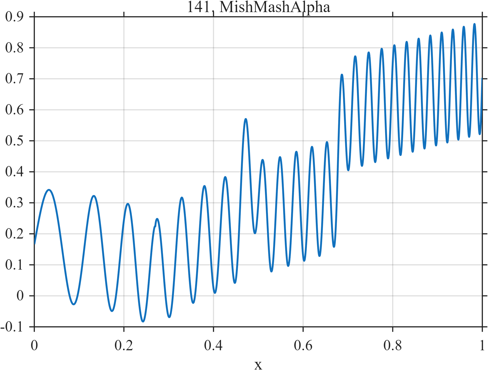

# TF141 — MishMashAlpha

## Overview

The **MishMashAlpha** artificial stress test combines a linear trend, square-root cusp, narrow bump, sharp step, and accelerating chirp.

## Mathematical Definition

Let $S(x;c,w)=[1+e^{-(x-c)/w}]^{-1}$. Then

$$
\begin{aligned}
f(x)={}&0.18x+0.25S(x;0.68,0.004)+0.32\sqrt{|x-0.27|}\\
&+0.22e^{-((x-0.48)/0.012)^2/2}+0.18\sin[2\pi(7x+18x^2)].
\end{aligned}
$$

## Morphological Characteristics

| Property | Description |
|---|---|
| Primary family | Trend, cusp, bump, step, and chirp |
| Local singularity | Cusp at $x=0.27$ |
| Abrupt feature | Step near $x=0.68$ |
| Main challenge | Each component favors a different smoothing scale |

## Parameters

| Parameter | Meaning | Default |
|---|---|---:|
| $0.32$ | Cusp amplitude | 0.32 |
| $0.012$ | Bump width | 0.012 |
| $18$ | Quadratic chirp coefficient | 18 |

## MATLAB Implementation

~~~matlab
N=1024; x=linspace(0,1,N); S=@(z,c,w) 1./(1+exp(-(z-c)/w));
f=0.18*x+0.25*S(x,0.68,0.004)+0.32*sqrt(abs(x-0.27)) ...
 +0.22*exp(-0.5*((x-0.48)/0.012).^2)+0.18*sin(2*pi*(7*x+18*x.^2));
plot(x,f); grid on; title('TF141 — MishMashAlpha')
exportgraphics(gcf,'TF141_MishMashAlpha.png','Resolution',300);
~~~

## Python Implementation

~~~python
import numpy as np
import matplotlib.pyplot as plt
N=1024; x=np.linspace(0,1,N); S=lambda c,w: 1/(1+np.exp(-(x-c)/w))
f=.18*x+.25*S(.68,.004)+.32*np.sqrt(np.abs(x-.27))
f+=.22*np.exp(-.5*((x-.48)/.012)**2)+.18*np.sin(2*np.pi*(7*x+18*x**2))
plt.plot(x,f); plt.grid(alpha=.3); plt.tight_layout()
plt.savefig('TF141_MishMashAlpha.png',dpi=300)
~~~

## Recommended Uses

- Mixed-regularity stress testing
- Cusp and step preservation
- Adaptive-scale evaluation

## Provenance

**Status:** Deliberately artificial MishMash stress test.

---

[← Previous: BridgeStrainEvent](TF140_BridgeStrainEvent.md) | [Category 8 Catalog](index.md) | [Next: MishMashBeta →](TF142_MishMashBeta.md)
