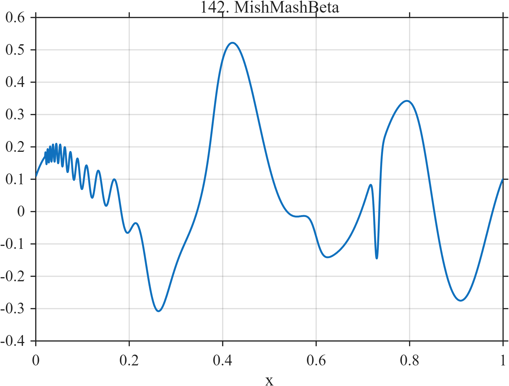

# TF142 — MishMashBeta

## Overview

The **MishMashBeta** stress test combines smooth low-frequency oscillations, Doppler-like compression, a finite plateau, an isolated negative spike, and a weak shoulder.

## Mathematical Definition

Let $u=\max(x,0.02)$ and $S(x;c,w)=[1+e^{-(x-c)/w}]^{-1}$. Then

$$
\begin{aligned}
f(x)={}&0.22\sin(6\pi x)+0.10\cos(10\pi x)\\
&+0.14\sqrt{u(1-u)}\sin\!\left(\frac{2\pi\,1.15}{u+0.05}\right)\\
&+0.20[S(x;0.38,0.008)-S(x;0.60,0.008)]\\
&-0.30e^{-((x-0.73)/0.005)^2/2}+0.09e^{-((x-0.82)/0.025)^2/2}.
\end{aligned}
$$

## Morphological Characteristics

| Property | Description |
|---|---|
| Primary family | Oscillation, compression, plateau, spike, and shoulder |
| Plateau | Approximately 0.38–0.60 |
| Narrow spike | Negative event near $x=0.73$ |
| Main challenge | Incompatible frequency and localization geometries |

## Parameters

| Parameter | Meaning | Default |
|---|---|---:|
| $1.15$ | Compressed-oscillation phase scale | 1.15 |
| $0.20$ | Plateau magnitude | 0.20 |
| $0.005$ | Negative-spike width | 0.005 |

## MATLAB Implementation

~~~matlab
N=1024; x=linspace(0,1,N); S=@(z,c,w) 1./(1+exp(-(z-c)/w)); u=max(x,0.02);
f=0.22*sin(2*pi*3*x)+0.10*cos(2*pi*5*x) ...
 +0.14*sqrt(u.*(1-u)).*sin(2*pi*1.15./(u+0.05)) ...
 +0.20*(S(x,0.38,0.008)-S(x,0.60,0.008)) ...
 -0.30*exp(-0.5*((x-0.73)/0.005).^2)+0.09*exp(-0.5*((x-0.82)/0.025).^2);
plot(x,f); grid on; title('TF142 — MishMashBeta')
exportgraphics(gcf,'TF142_MishMashBeta.png','Resolution',300);
~~~

## Python Implementation

~~~python
import numpy as np
import matplotlib.pyplot as plt
N=1024; x=np.linspace(0,1,N); S=lambda c,w: 1/(1+np.exp(-(x-c)/w)); u=np.maximum(x,.02)
f=.22*np.sin(2*np.pi*3*x)+.10*np.cos(2*np.pi*5*x)
f+=.14*np.sqrt(u*(1-u))*np.sin(2*np.pi*1.15/(u+.05))
f+=.20*(S(.38,.008)-S(.60,.008))-.30*np.exp(-.5*((x-.73)/.005)**2)
f+=.09*np.exp(-.5*((x-.82)/.025)**2)
plt.plot(x,f); plt.grid(alpha=.3); plt.tight_layout()
plt.savefig('TF142_MishMashBeta.png',dpi=300)
~~~

## Recommended Uses

- Adversarial denoising evaluation
- Spike and plateau preservation
- Nonuniform-frequency recovery

## Provenance

**Status:** Deliberately artificial MishMash stress test.

---

[← Previous: MishMashAlpha](TF141_MishMashAlpha.md) | [Category 8 Catalog](index.md) | [Next: DoubletOnCliff →](TF143_DoubletOnCliff.md)
