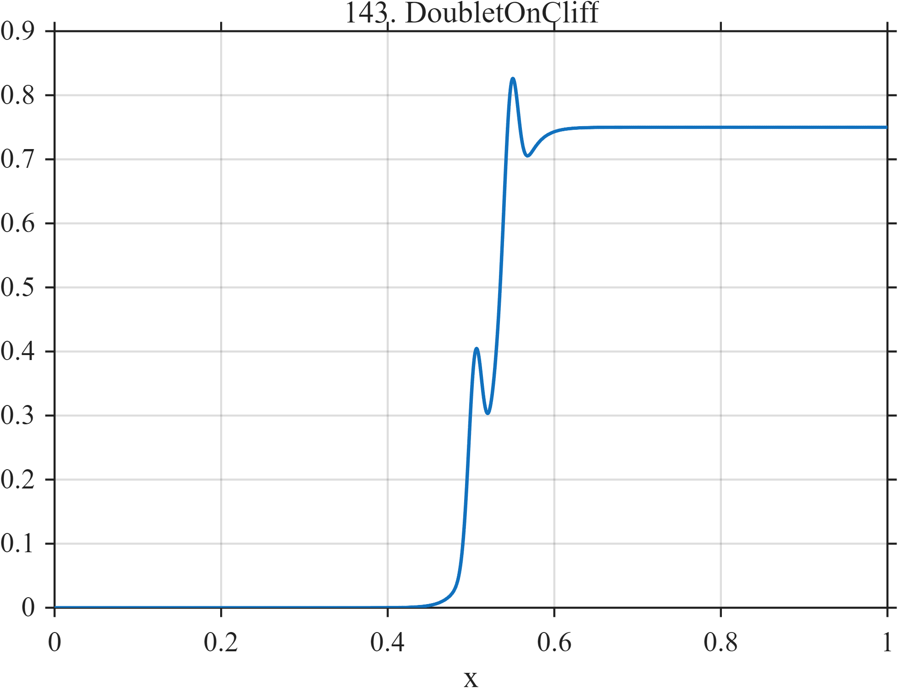

# TF143 — DoubletOnCliff

## Overview

The **DoubletOnCliff** stress test places two nearby narrow peaks directly on a steep sigmoidal transition.

## Mathematical Definition

Let $S(x;c,w)=[1+e^{-(x-c)/w}]^{-1}$ and $g(x;c,w)=e^{-((x-c)/w)^2/2}$. Then

$$
f(x)=0.75S(x;0.53,0.015)+0.28g(x;0.505,0.008)+0.24g(x;0.548,0.008).
$$

## Morphological Characteristics

| Property | Description |
|---|---|
| Primary family | Close peak doublet on steep edge |
| Edge center | $x=0.53$ |
| Doublet centers | 0.505 and 0.548 |
| Main challenge | Maintaining peak resolution while recovering the underlying cliff |

## Parameters

| Parameter | Meaning | Default |
|---|---|---:|
| $0.015$ | Edge width | 0.015 |
| $0.008$ | Common peak width | 0.008 |
| $0.28,0.24$ | Peak amplitudes | As shown |

## MATLAB Implementation

~~~matlab
N=1024; x=linspace(0,1,N); S=@(z,c,w) 1./(1+exp(-(z-c)/w));
f=0.75*S(x,0.53,0.015)+0.28*exp(-0.5*((x-0.505)/0.008).^2) ...
 +0.24*exp(-0.5*((x-0.548)/0.008).^2);
plot(x,f); grid on; title('TF143 — DoubletOnCliff')
exportgraphics(gcf,'TF143_DoubletOnCliff.png','Resolution',300);
~~~

## Python Implementation

~~~python
import numpy as np
import matplotlib.pyplot as plt
N=1024; x=np.linspace(0,1,N); S=lambda c,w: 1/(1+np.exp(-(x-c)/w))
f=.75*S(.53,.015)+.28*np.exp(-.5*((x-.505)/.008)**2)
f+=.24*np.exp(-.5*((x-.548)/.008)**2)
plt.plot(x,f); plt.grid(alpha=.3); plt.tight_layout()
plt.savefig('TF143_DoubletOnCliff.png',dpi=300)
~~~

## Recommended Uses

- Edge-and-peak resolution testing
- Close-doublet preservation
- Local scale-adaptation evaluation

## Provenance

**Status:** Deliberately artificial MishMash stress test.

---

[← Previous: MishMashBeta](TF142_MishMashBeta.md) | [Category 8 Catalog](index.md) | [Next: NeedleInChirp →](TF144_NeedleInChirp.md)
