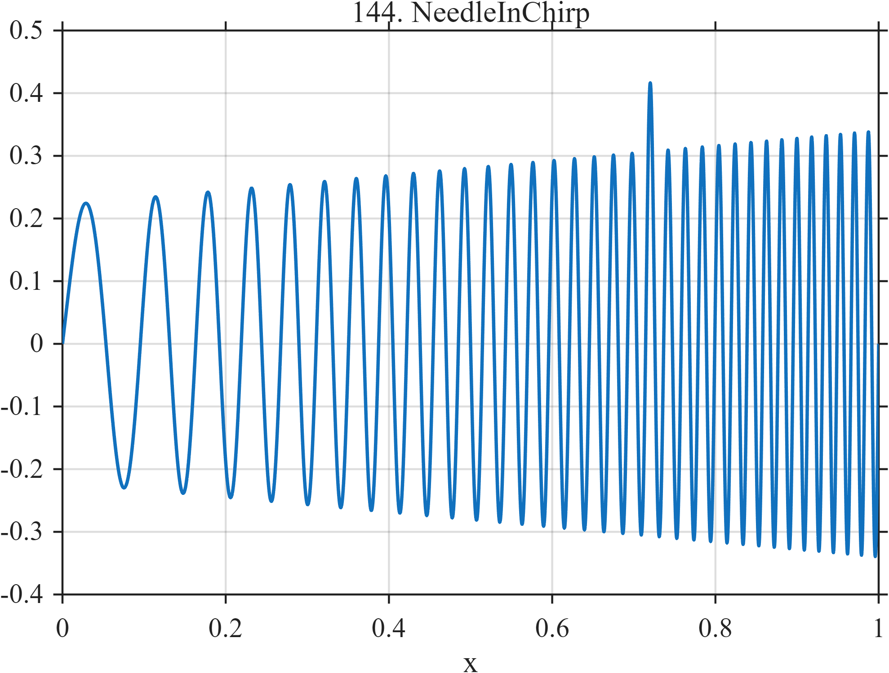

# TF144 — NeedleInChirp

## Overview

The **NeedleInChirp** stress test embeds a narrow weak needle where an accelerating chirp has already become dense.

## Mathematical Definition

$$
f(x)=0.34(0.65+0.35x)\sin[2\pi(8x+26x^2)]+0.11e^{-((x-0.72)/0.003)^2/2}.
$$

## Morphological Characteristics

| Property | Description |
|---|---|
| Primary family | Amplitude-varying chirp with embedded needle |
| Chirp | Quadratic phase with coefficient 26 |
| Needle | Center 0.72, width 0.003 |
| Main challenge | Sparse-event detection competes with dense local oscillation |

## Parameters

| Parameter | Meaning | Default |
|---|---|---:|
| $26$ | Quadratic chirp coefficient | 26 |
| $0.11$ | Needle amplitude | 0.11 |
| $0.003$ | Needle width | 0.003 |

## MATLAB Implementation

~~~matlab
N=1024; x=linspace(0,1,N);
f=(0.65+0.35*x).*0.34.*sin(2*pi*(8*x+26*x.^2)) ...
 +0.11*exp(-0.5*((x-0.72)/0.003).^2);
plot(x,f); grid on; title('TF144 — NeedleInChirp')
exportgraphics(gcf,'TF144_NeedleInChirp.png','Resolution',300);
~~~

## Python Implementation

~~~python
import numpy as np
import matplotlib.pyplot as plt
N=1024; x=np.linspace(0,1,N)
f=(.65+.35*x)*.34*np.sin(2*np.pi*(8*x+26*x**2))
f+=.11*np.exp(-.5*((x-.72)/.003)**2)
plt.plot(x,f); plt.grid(alpha=.3); plt.tight_layout()
plt.savefig('TF144_NeedleInChirp.png',dpi=300)
~~~

## Recommended Uses

- Dense-chirp denoising
- Embedded-needle detection
- Fine-scale coefficient competition tests

## Provenance

**Status:** Deliberately artificial MishMash stress test.

---

[← Previous: DoubletOnCliff](TF143_DoubletOnCliff.md) | [Category 8 Catalog](index.md) | [Next: DerivativeZoo →](TF145_DerivativeZoo.md)
