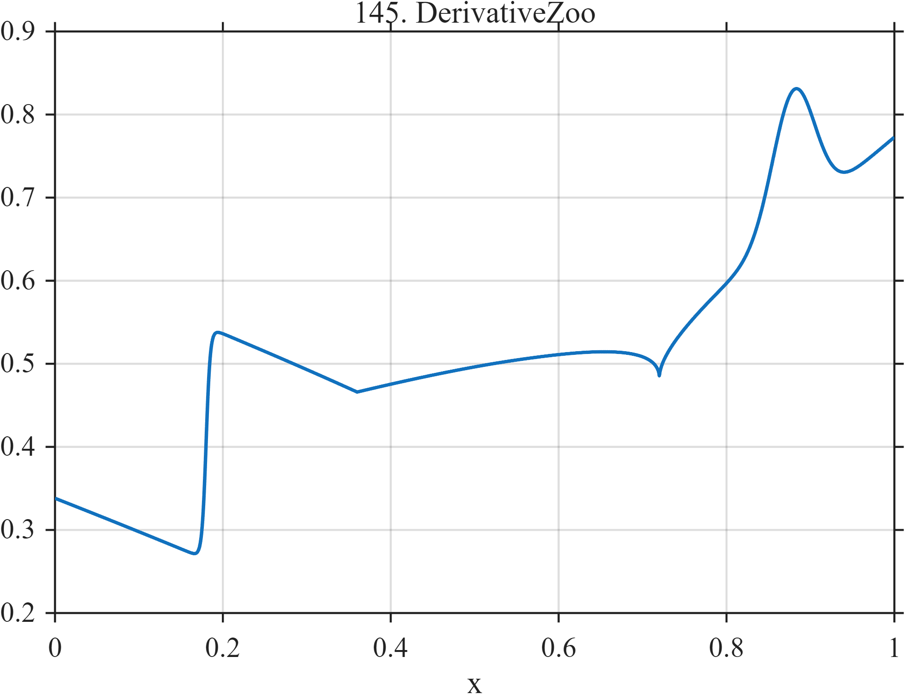

# TF145 — DerivativeZoo

## Overview

The **DerivativeZoo** stress test places a near jump, kink, curvature change, square-root cusp, smooth trend, and analytic bump in one signal.

## Mathematical Definition

Let $S(x;c,w)=[1+e^{-(x-c)/w}]^{-1}$. Then

$$
\begin{aligned}
f(x)={}&0.10x+0.28S(x;0.18,0.0025)+0.35|x-0.36|\\
&+0.18(x-0.55)^2I(x\ge0.55)+0.25\sqrt{|x-0.72|}\\
&+0.16e^{-((x-0.88)/0.025)^2/2}.
\end{aligned}
$$

## Morphological Characteristics

| Property | Description |
|---|---|
| Primary family | Multiple orders of local regularity |
| Nonsmooth features | Near jump, kink, and square-root cusp |
| Smooth features | Trend, curvature change, and Gaussian bump |
| Main challenge | Adapting to different differentiability classes within one record |

## Parameters

| Parameter | Meaning | Default |
|---|---|---:|
| $0.18$ | Near-jump location | 0.18 |
| $0.36$ | Kink location | 0.36 |
| $0.72$ | Cusp location | 0.72 |

## MATLAB Implementation

~~~matlab
N=1024; x=linspace(0,1,N); S=@(z,c,w) 1./(1+exp(-(z-c)/w));
f=0.10*x+0.28*S(x,0.18,0.0025)+0.35*abs(x-0.36) ...
 +0.18*(x-0.55).^2.*(x>=0.55)+0.25*sqrt(abs(x-0.72)) ...
 +0.16*exp(-0.5*((x-0.88)/0.025).^2);
plot(x,f); grid on; title('TF145 — DerivativeZoo')
exportgraphics(gcf,'TF145_DerivativeZoo.png','Resolution',300);
~~~

## Python Implementation

~~~python
import numpy as np
import matplotlib.pyplot as plt
N=1024; x=np.linspace(0,1,N); S=lambda c,w: 1/(1+np.exp(-(x-c)/w))
f=.10*x+.28*S(.18,.0025)+.35*np.abs(x-.36)
f+=.18*(x-.55)**2*(x>=.55)+.25*np.sqrt(np.abs(x-.72))
f+=.16*np.exp(-.5*((x-.88)/.025)**2)
plt.plot(x,f); plt.grid(alpha=.3); plt.tight_layout()
plt.savefig('TF145_DerivativeZoo.png',dpi=300)
~~~

## Recommended Uses

- Local-regularity adaptation tests
- Edge, kink, and cusp preservation
- Mixed-smoothness benchmarking

## Provenance

**Status:** Deliberately artificial MishMash stress test.

---

[← Previous: NeedleInChirp](TF144_NeedleInChirp.md) | [Category 8 Catalog](index.md) | [Next: MultiscaleComb →](TF146_MultiscaleComb.md)
