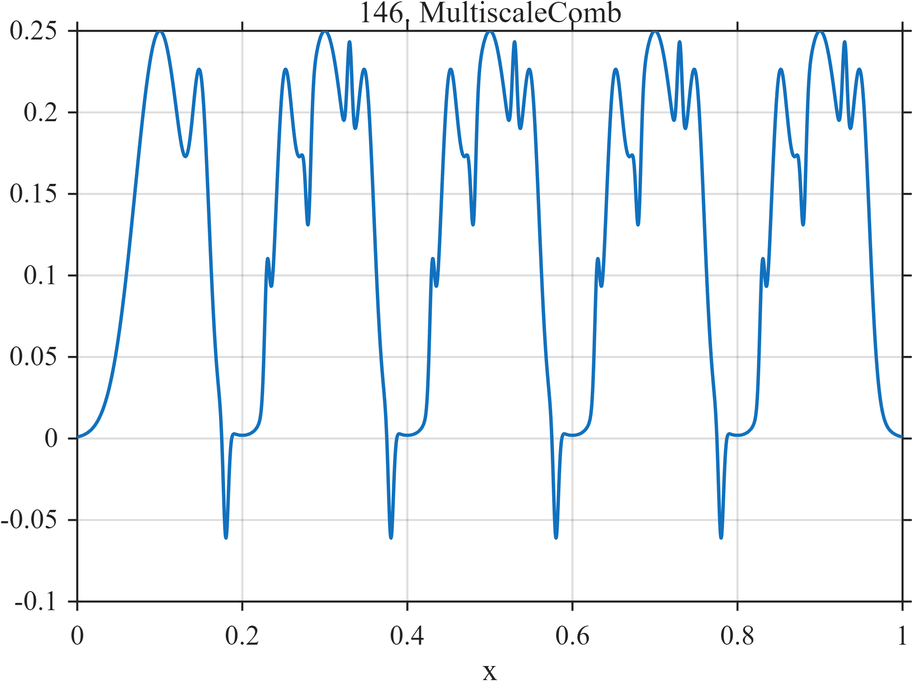

# TF146 — MultiscaleComb

## Overview

The **MultiscaleComb** stress test combines broad periodic peaks, narrower peaks, and still narrower alternating-sign spikes at three simultaneous resolution scales.

## Mathematical Definition

Let $g(x;c,w)=e^{-((x-c)/w)^2/2}$ and

$$
\mathcal C_1=(0.10,0.30,0.50,0.70,0.90),
$$

$$
\mathcal C_2=(0.15,0.25,\ldots,0.95),\qquad
\mathcal C_3=(0.18,0.23,\ldots,0.93).
$$

Then

$$
f(x)=0.25\sum_{c\in\mathcal C_1}g(x;c,0.030)
+0.16\sum_{c\in\mathcal C_2}g(x;c,0.010)
+0.07\sum_{k=1}^{16}(-1)^k g(x;c_{3k},0.003).
$$

## Morphological Characteristics

| Property | Description |
|---|---|
| Primary family | Three-scale peak comb |
| Widths | 0.030, 0.010, and 0.003 |
| Fine scale | Alternating-sign spikes |
| Main challenge | Simultaneous recovery at three resolution scales |

## Parameters

| Parameter | Meaning | Default |
|---|---|---:|
| $0.25,0.16,0.07$ | Scale-specific amplitudes | As shown |
| $0.030,0.010,0.003$ | Peak widths | As shown |

## MATLAB Implementation

~~~matlab
N=1024; x=linspace(0,1,N); f=zeros(size(x));
for c=0.10:0.20:0.90, f=f+0.25*exp(-0.5*((x-c)/0.030).^2); end
for c=0.15:0.10:0.95, f=f+0.16*exp(-0.5*((x-c)/0.010).^2); end
cs=0.18:0.05:0.93;
for k=1:numel(cs), f=f+0.07*(-1)^k*exp(-0.5*((x-cs(k))/0.003).^2); end
plot(x,f); grid on; title('TF146 — MultiscaleComb')
exportgraphics(gcf,'TF146_MultiscaleComb.png','Resolution',300);
~~~

## Python Implementation

~~~python
import numpy as np
import matplotlib.pyplot as plt
N=1024; x=np.linspace(0,1,N); f=np.zeros_like(x)
for c in np.arange(.10,.901,.20): f+=.25*np.exp(-.5*((x-c)/.030)**2)
for c in np.arange(.15,.951,.10): f+=.16*np.exp(-.5*((x-c)/.010)**2)
for k,c in enumerate(np.arange(.18,.931,.05),start=1):
    f+=.07*(-1)**k*np.exp(-.5*((x-c)/.003)**2)
plt.plot(x,f); plt.grid(alpha=.3); plt.tight_layout()
plt.savefig('TF146_MultiscaleComb.png',dpi=300)
~~~

## Recommended Uses

- Three-scale resolution testing
- Alternating-spike preservation
- Adaptive bandwidth evaluation

## Provenance

**Status:** Deliberately artificial MishMash stress test.

---

[← Previous: DerivativeZoo](TF145_DerivativeZoo.md) | [Category 8 Catalog](index.md) | [Next: FrequencyCrossing →](TF147_FrequencyCrossing.md)
