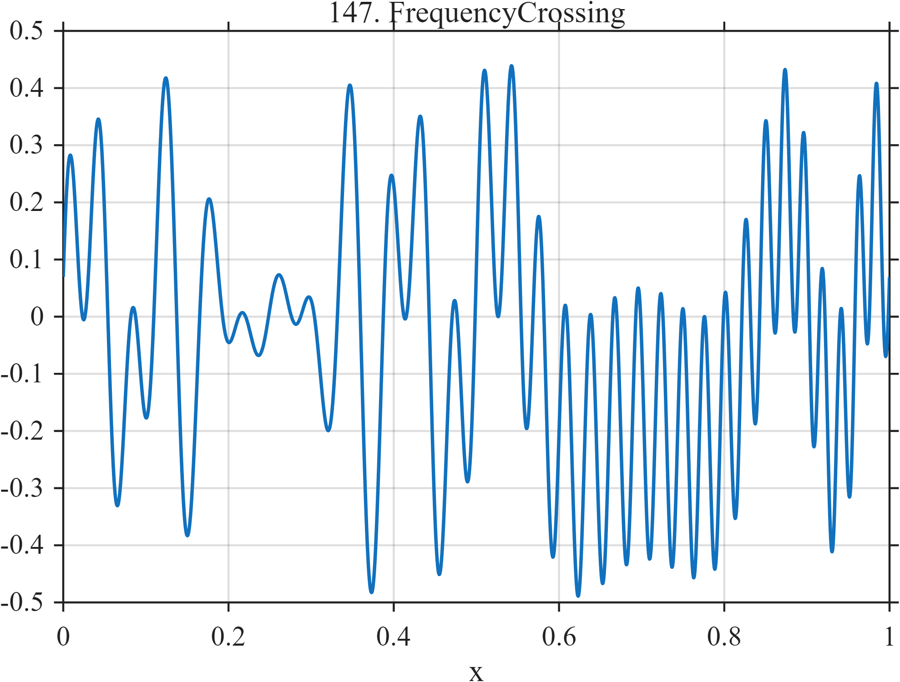

# TF147 — FrequencyCrossing

## Overview

The **FrequencyCrossing** stress test combines an increasing-frequency chirp and a decreasing-frequency chirp whose instantaneous frequencies cross.

## Mathematical Definition

Let

$$
\phi_u(x)=2\pi(8x+20x^2),\qquad
\phi_d(x)=2\pi(28x-20x^2),
$$

and $A(x)=0.75+0.25e^{-((x-0.50)/0.30)^2/2}$. Then

$$
f(x)=A(x)[0.25\sin\phi_u(x)+0.25\sin(\phi_d(x)+0.35)].
$$

## Morphological Characteristics

| Property | Description |
|---|---|
| Primary family | Two chirps with crossing instantaneous frequencies |
| Phase trends | One increasing and one decreasing |
| Interference | Local reinforcement and cancellation |
| Main challenge | Avoiding false interpretation of interference as signal disappearance |

## Parameters

| Parameter | Meaning | Default |
|---|---|---:|
| $20,-20$ | Quadratic phase coefficients | As shown |
| $0.35$ | Relative phase offset | 0.35 |

## MATLAB Implementation

~~~matlab
N=1024; x=linspace(0,1,N);
phiUp=2*pi*(8*x+20*x.^2); phiDown=2*pi*(28*x-20*x.^2);
amplitude=0.75+0.25*exp(-0.5*((x-0.50)/0.30).^2);
f=amplitude.*(0.25*sin(phiUp)+0.25*sin(phiDown+0.35));
plot(x,f); grid on; title('TF147 — FrequencyCrossing')
exportgraphics(gcf,'TF147_FrequencyCrossing.png','Resolution',300);
~~~

## Python Implementation

~~~python
import numpy as np
import matplotlib.pyplot as plt
N=1024; x=np.linspace(0,1,N)
phi_up=2*np.pi*(8*x+20*x**2); phi_down=2*np.pi*(28*x-20*x**2)
amplitude=.75+.25*np.exp(-.5*((x-.50)/.30)**2)
f=amplitude*(.25*np.sin(phi_up)+.25*np.sin(phi_down+.35))
plt.plot(x,f); plt.grid(alpha=.3); plt.tight_layout()
plt.savefig('TF147_FrequencyCrossing.png',dpi=300)
~~~

## Recommended Uses

- Crossing-frequency recovery
- Phase-sensitive denoising
- Interference preservation

## Provenance

**Status:** Deliberately artificial MishMash stress test.

---

[← Previous: MultiscaleComb](TF146_MultiscaleComb.md) | [Category 8 Catalog](index.md) | [Next: PhaseResetBurst →](TF148_PhaseResetBurst.md)
