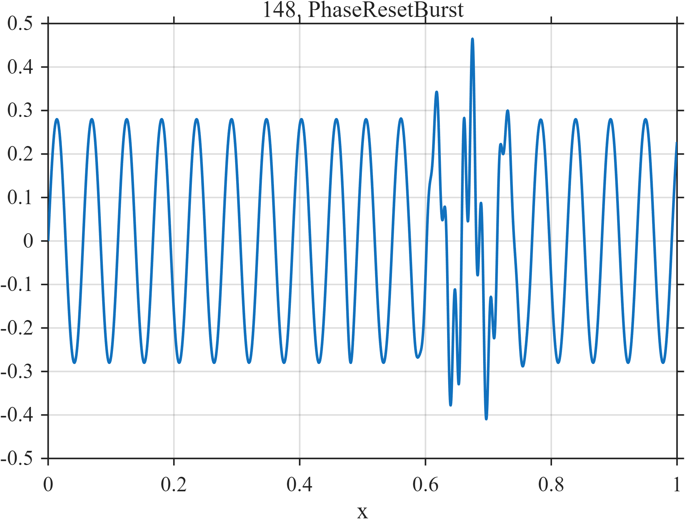

# TF148 — PhaseResetBurst

## Overview

The **PhaseResetBurst** stress test applies an abrupt phase reset to a nearly stationary oscillation without a large amplitude jump, then adds a short high-frequency packet.

## Mathematical Definition

Let $S(x;c,w)=[1+e^{-(x-c)/w}]^{-1}$. Then

$$
f(x)=0.28\sin[36\pi x+0.95S(x;0.48,0.003)]
+0.20e^{-((x-0.67)/0.035)^2/2}\sin(140\pi x).
$$

## Morphological Characteristics

| Property | Description |
|---|---|
| Primary family | Abrupt phase reset plus localized fast packet |
| Phase reset | Near $x=0.48$ |
| Burst | 70-cycle packet centered at 0.67 |
| Main challenge | Detecting phase change without relying on amplitude discontinuity |

## Parameters

| Parameter | Meaning | Default |
|---|---|---:|
| $0.95$ | Phase-reset magnitude | 0.95 radians |
| $0.003$ | Reset width | 0.003 |
| $70$ | Burst cycle frequency | 70 |

## MATLAB Implementation

~~~matlab
N=1024; x=linspace(0,1,N); S=@(z,c,w) 1./(1+exp(-(z-c)/w));
f=0.28*sin(2*pi*18*x+0.95*S(x,0.48,0.003)) ...
 +0.20*exp(-0.5*((x-0.67)/0.035).^2).*sin(2*pi*70*x);
plot(x,f); grid on; title('TF148 — PhaseResetBurst')
exportgraphics(gcf,'TF148_PhaseResetBurst.png','Resolution',300);
~~~

## Python Implementation

~~~python
import numpy as np
import matplotlib.pyplot as plt
N=1024; x=np.linspace(0,1,N); S=lambda c,w: 1/(1+np.exp(-(x-c)/w))
f=.28*np.sin(2*np.pi*18*x+.95*S(.48,.003))
f+=.20*np.exp(-.5*((x-.67)/.035)**2)*np.sin(2*np.pi*70*x)
plt.plot(x,f); plt.grid(alpha=.3); plt.tight_layout()
plt.savefig('TF148_PhaseResetBurst.png',dpi=300)
~~~

## Recommended Uses

- Phase-reset detection
- High-frequency packet preservation
- Phase-sensitive shrinkage evaluation

## Provenance

**Status:** Deliberately artificial MishMash stress test.

---

[← Previous: FrequencyCrossing](TF147_FrequencyCrossing.md) | [Category 8 Catalog](index.md) | [Next: LacunaryCascade →](TF149_LacunaryCascade.md)
