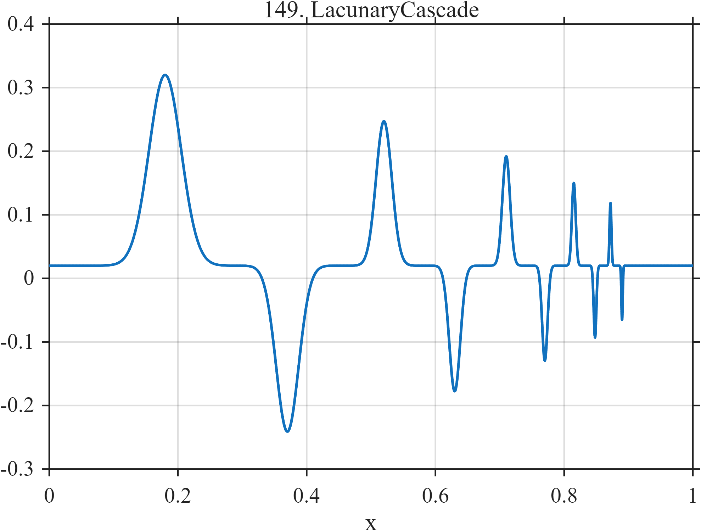

# TF149 — LacunaryCascade

## Overview

The **LacunaryCascade** stress test contains alternating events that become progressively narrower, smaller, and more tightly spaced, with deliberate gaps between scales.

## Mathematical Definition

Let $g(x;c,w)=e^{-((x-c)/w)^2/2}$ and

$$
c=(0.18,0.37,0.52,0.63,0.71,0.77,0.815,0.848,0.872,0.890).
$$

For $k=1,\ldots,10$, set

$$
a_k=0.30(0.87)^{k-1},\qquad w_k=0.025(0.70)^{k-1}.
$$

Then

$$
f(x)=0.02+\sum_{k=1}^{10}a_k(-1)^{k+1}g(x;c_k,w_k).
$$

## Morphological Characteristics

| Property | Description |
|---|---|
| Primary family | Alternating geometrically shrinking cascade |
| Amplitude ratio | 0.87 per event |
| Width ratio | 0.70 per event |
| Main challenge | Strongly nonuniform event scales and spacing |

## Parameters

| Parameter | Meaning | Default |
|---|---|---:|
| $c_k$ | Event centers | As above |
| $0.87$ | Amplitude contraction | 0.87 |
| $0.70$ | Width contraction | 0.70 |

## MATLAB Implementation

~~~matlab
N=1024; x=linspace(0,1,N); f=0.02*ones(size(x));
c=[0.18 0.37 0.52 0.63 0.71 0.77 0.815 0.848 0.872 0.890];
for k=1:numel(c)
    amp=0.30*(0.87^(k-1)); width=0.025*(0.70^(k-1));
    f=f+amp*(-1)^(k+1)*exp(-0.5*((x-c(k))/width).^2);
end
plot(x,f); grid on; title('TF149 — LacunaryCascade')
exportgraphics(gcf,'TF149_LacunaryCascade.png','Resolution',300);
~~~

## Python Implementation

~~~python
import numpy as np
import matplotlib.pyplot as plt
N=1024; x=np.linspace(0,1,N); f=.02*np.ones_like(x)
c=[.18,.37,.52,.63,.71,.77,.815,.848,.872,.890]
for k,ck in enumerate(c,start=1):
    amp=.30*(.87**(k-1)); width=.025*(.70**(k-1))
    f+=amp*((-1)**(k+1))*np.exp(-.5*((x-ck)/width)**2)
plt.plot(x,f); plt.grid(alpha=.3); plt.tight_layout()
plt.savefig('TF149_LacunaryCascade.png',dpi=300)
~~~

## Recommended Uses

- Nonuniform-scale stress testing
- Compressed-event resolution
- Alternating-feature preservation

## Provenance

**Status:** Deliberately artificial MishMash stress test.

---

[← Previous: PhaseResetBurst](TF148_PhaseResetBurst.md) | [Category 8 Catalog](index.md) | [Next: SmoothRoughSmooth →](TF150_SmoothRoughSmooth.md)
