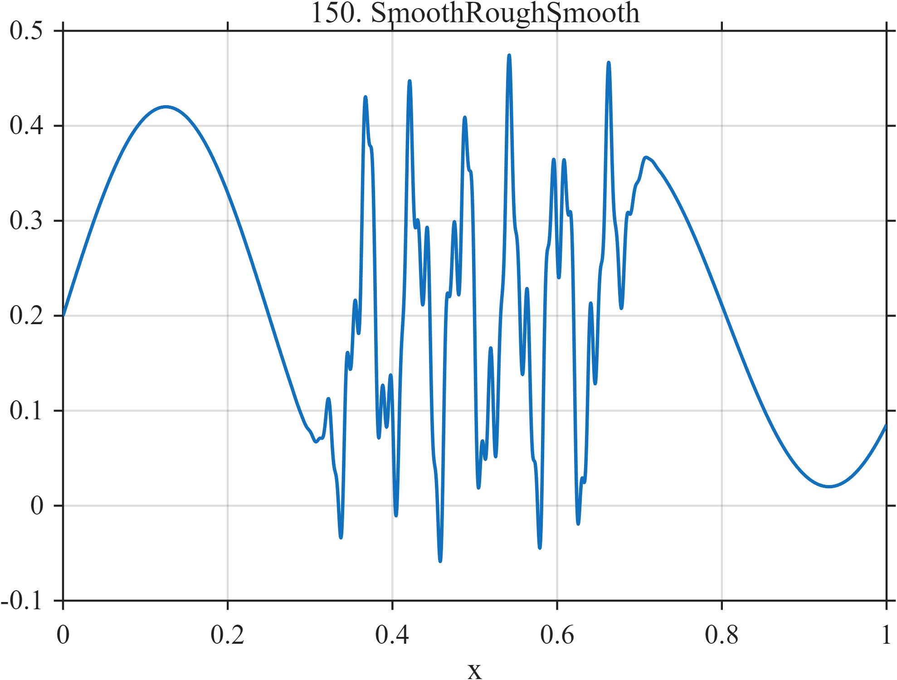

# TF150 — SmoothRoughSmooth

## Overview

The **SmoothRoughSmooth** stress test transitions from a smooth low-frequency region to a finite interval with three high-frequency components, then returns to a smooth regime.

## Mathematical Definition

Let $S_c=S(x;c,0.008)=[1+e^{-(x-c)/0.008}]^{-1}$ and $W=S_{0.33}-S_{0.68}$. Define

$$
L(x)=0.20+0.22\sin(4\pi x),\qquad
R(x)=0.20+0.18\cos[4\pi(x-0.68)],
$$

$$
q(x)=0.16\sin(34\pi x)+0.08\sin(82\pi x+0.3)+0.04\sin(182\pi x-0.2).
$$

Then

$$
f(x)=L(x)(1-S_{0.33})+W[0.20+q(x)]+R(x)S_{0.68}.
$$

## Morphological Characteristics

| Property | Description |
|---|---|
| Primary family | Smooth–rough–smooth transition |
| Rough interval | Approximately 0.33–0.68 |
| Rough scales | 17, 41, and 91 cycles |
| Main challenge | The optimal smoothing level changes abruptly across the record |

## Parameters

| Parameter | Meaning | Default |
|---|---|---:|
| $0.33,0.68$ | Rough-window boundaries | As shown |
| $0.16,0.08,0.04$ | Rough-component amplitudes | As shown |

## MATLAB Implementation

~~~matlab
N=1024; x=linspace(0,1,N); S=@(z,c,w) 1./(1+exp(-(z-c)/w));
left=0.20+0.22*sin(2*pi*2*x); roughWindow=S(x,0.33,0.008)-S(x,0.68,0.008);
rough=0.16*sin(2*pi*17*x)+0.08*sin(2*pi*41*x+0.3)+0.04*sin(2*pi*91*x-0.2);
right=0.20+0.18*cos(2*pi*2*(x-0.68));
f=left.*(1-S(x,0.33,0.008))+roughWindow.*(0.20+rough)+right.*S(x,0.68,0.008);
plot(x,f); grid on; title('TF150 — SmoothRoughSmooth')
exportgraphics(gcf,'TF150_SmoothRoughSmooth.png','Resolution',300);
~~~

## Python Implementation

~~~python
import numpy as np
import matplotlib.pyplot as plt
N=1024; x=np.linspace(0,1,N); S=lambda c,w: 1/(1+np.exp(-(x-c)/w))
left=.20+.22*np.sin(2*np.pi*2*x); window=S(.33,.008)-S(.68,.008)
rough=.16*np.sin(2*np.pi*17*x)+.08*np.sin(2*np.pi*41*x+.3)+.04*np.sin(2*np.pi*91*x-.2)
right=.20+.18*np.cos(2*np.pi*2*(x-.68))
f=left*(1-S(.33,.008))+window*(.20+rough)+right*S(.68,.008)
plt.plot(x,f); plt.grid(alpha=.3); plt.tight_layout()
plt.savefig('TF150_SmoothRoughSmooth.png',dpi=300)
~~~

## Recommended Uses

- Spatially adaptive smoothing tests
- Rough-window localization
- Multiband structure preservation

## Provenance

**Status:** Deliberately artificial MishMash stress test.

---

[← Previous: LacunaryCascade](TF149_LacunaryCascade.md) | [Category 8 Catalog](index.md) | [Next: PeakOnPeak →](TF151_PeakOnPeak.md)
