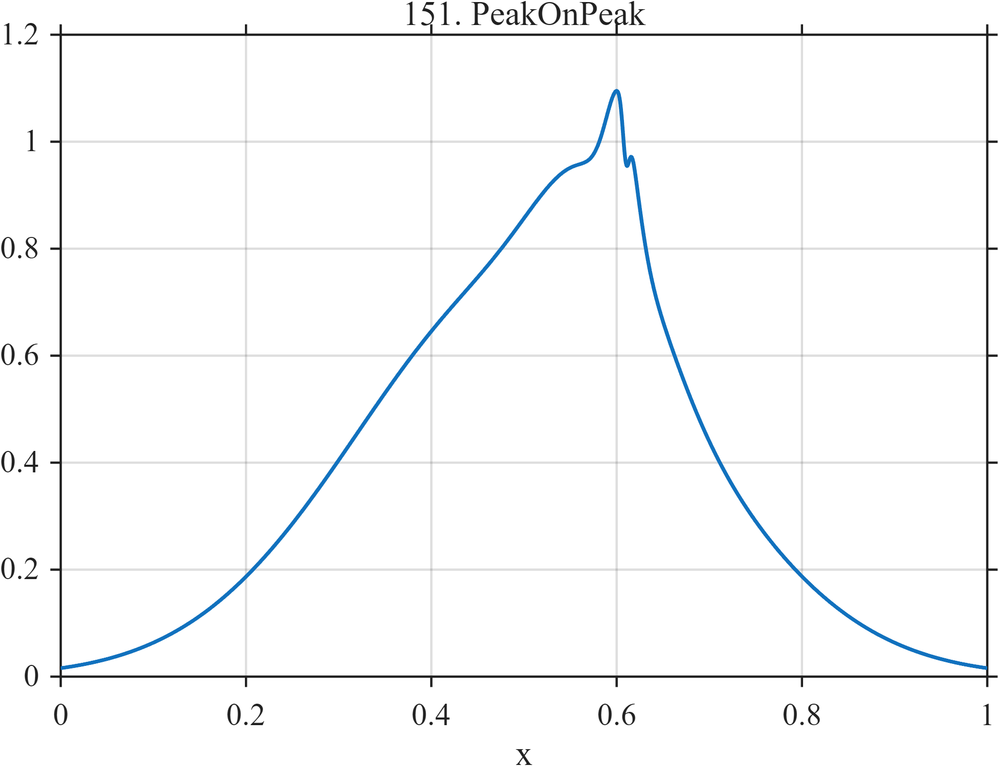

# TF151 — PeakOnPeak

## Overview

The **PeakOnPeak** stress test nests a broad peak, a shoulder, a narrower positive peak, and a very narrow negative notch.

## Mathematical Definition

Let $g(x;c,w)=e^{-((x-c)/w)^2/2}$. Then

$$
f(x)=0.75g(x;0.50,0.18)+0.26g(x;0.58,0.060)+0.22g(x;0.605,0.015)-0.10g(x;0.610,0.0035).
$$

## Morphological Characteristics

| Property | Description |
|---|---|
| Primary family | Hierarchically nested peaks and notch |
| Width hierarchy | 0.18, 0.060, 0.015, and 0.0035 |
| Finest feature | Negative notch near $x=0.610$ |
| Main challenge | Preserving small nested structure inside dominant features |

## Parameters

| Parameter | Meaning | Default |
|---|---|---:|
| $0.75,0.26,0.22,-0.10$ | Component amplitudes | As shown |
| $0.18,0.060,0.015,0.0035$ | Component widths | As shown |

## MATLAB Implementation

~~~matlab
N=1024; x=linspace(0,1,N);
f=0.75*exp(-0.5*((x-0.50)/0.18).^2)+0.26*exp(-0.5*((x-0.58)/0.060).^2) ...
 +0.22*exp(-0.5*((x-0.605)/0.015).^2)-0.10*exp(-0.5*((x-0.610)/0.0035).^2);
plot(x,f); grid on; title('TF151 — PeakOnPeak')
exportgraphics(gcf,'TF151_PeakOnPeak.png','Resolution',300);
~~~

## Python Implementation

~~~python
import numpy as np
import matplotlib.pyplot as plt
N=1024; x=np.linspace(0,1,N)
f=.75*np.exp(-.5*((x-.50)/.18)**2)+.26*np.exp(-.5*((x-.58)/.060)**2)
f+=.22*np.exp(-.5*((x-.605)/.015)**2)-.10*np.exp(-.5*((x-.610)/.0035)**2)
plt.plot(x,f); plt.grid(alpha=.3); plt.tight_layout()
plt.savefig('TF151_PeakOnPeak.png',dpi=300)
~~~

## Recommended Uses

- Nested-feature preservation
- Multiscale peak/notch resolution
- Oversmoothing detection

## Provenance

**Status:** Deliberately artificial MishMash stress test.

---

[← Previous: SmoothRoughSmooth](TF150_SmoothRoughSmooth.md) | [Category 8 Catalog](index.md) | [Next: FalseFlat →](TF152_FalseFlat.md)
