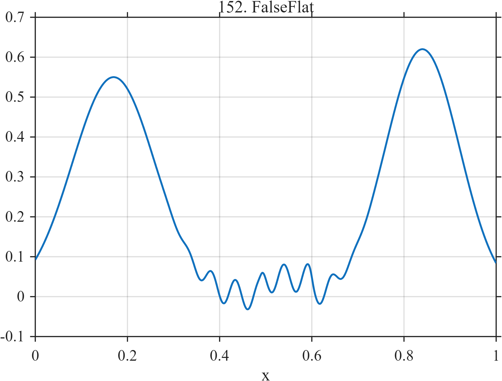

# TF152 — FalseFlat

## Overview

The **FalseFlat** stress test places two large peaks at the ends while the apparently quiet center contains a weak oscillation and a tiny finite level change.

## Mathematical Definition

Let $S(x;c,w)=[1+e^{-(x-c)/w}]^{-1}$ and $g(x;c,w)=e^{-((x-c)/w)^2/2}$. Then

$$
\begin{aligned}
f(x)={}&0.55g(x;0.17,0.09)+0.62g(x;0.84,0.08)\\
&+0.035\sin(38\pi x)[S(x;0.35,0.02)-S(x;0.66,0.02)]\\
&+0.045[S(x;0.49,0.003)-S(x;0.60,0.003)].
\end{aligned}
$$

## Morphological Characteristics

| Property | Description |
|---|---|
| Primary family | High-energy ends with low-energy central structure |
| Central oscillation | Active approximately 0.35–0.66 |
| Tiny level change | Approximately 0.49–0.60 |
| Main challenge | Global AMSE may hide complete loss of central features |

## Parameters

| Parameter | Meaning | Default |
|---|---|---:|
| $0.55,0.62$ | End-peak amplitudes | As shown |
| $0.035$ | Central oscillation amplitude | 0.035 |
| $0.045$ | Central level-change magnitude | 0.045 |

## MATLAB Implementation

~~~matlab
N=1024; x=linspace(0,1,N); S=@(z,c,w) 1./(1+exp(-(z-c)/w));
f=0.55*exp(-0.5*((x-0.17)/0.09).^2)+0.62*exp(-0.5*((x-0.84)/0.08).^2) ...
 +0.035*sin(2*pi*19*x).*(S(x,0.35,0.02)-S(x,0.66,0.02)) ...
 +0.045*(S(x,0.49,0.003)-S(x,0.60,0.003));
plot(x,f); grid on; title('TF152 — FalseFlat')
exportgraphics(gcf,'TF152_FalseFlat.png','Resolution',300);
~~~

## Python Implementation

~~~python
import numpy as np
import matplotlib.pyplot as plt
N=1024; x=np.linspace(0,1,N); S=lambda c,w: 1/(1+np.exp(-(x-c)/w))
f=.55*np.exp(-.5*((x-.17)/.09)**2)+.62*np.exp(-.5*((x-.84)/.08)**2)
f+=.035*np.sin(2*np.pi*19*x)*(S(.35,.02)-S(.66,.02))
f+=.045*(S(.49,.003)-S(.60,.003))
plt.plot(x,f); plt.grid(alpha=.3); plt.tight_layout()
plt.savefig('TF152_FalseFlat.png',dpi=300)
~~~

## Recommended Uses

- Feature-aware risk evaluation
- Low-energy structure preservation
- Global-AMSE failure demonstrations

## Provenance

**Status:** Deliberately artificial MishMash stress test.

---

[← Previous: PeakOnPeak](TF151_PeakOnPeak.md) | [Category 8 Catalog](index.md) | [Next: SymmetryBreak →](TF153_SymmetryBreak.md)
