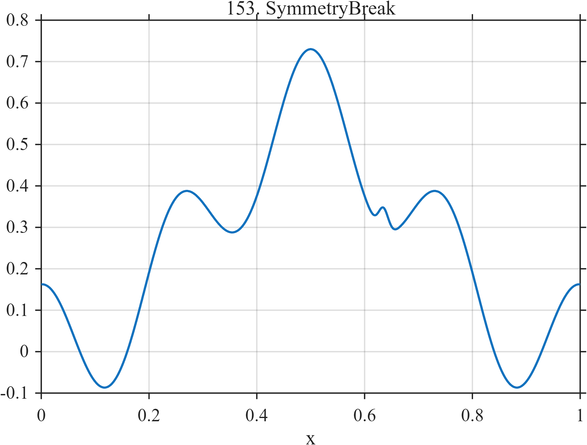

# TF153 — SymmetryBreak

## Overview

The **SymmetryBreak** stress test is dominated by a nearly symmetric broad peak and cosine component, with a small localized perturbation that breaks the symmetry.

## Mathematical Definition

Let $g(x;c,w)=e^{-((x-c)/w)^2/2}$. Then

$$
f(x)=0.58g(x;0.50,0.18)+0.15\cos[8\pi(x-0.50)]+0.055g(x;0.635,0.009).
$$

## Morphological Characteristics

| Property | Description |
|---|---|
| Primary family | Near symmetry with weak localized asymmetry |
| Symmetry center | $x=0.50$ |
| Breaking feature | Peak near $x=0.635$ |
| Main challenge | Avoiding false restoration of symmetry by over-regularization |

## Parameters

| Parameter | Meaning | Default |
|---|---|---:|
| $0.58$ | Broad symmetric-peak amplitude | 0.58 |
| $0.055$ | Symmetry-breaking amplitude | 0.055 |
| $0.009$ | Symmetry-breaking width | 0.009 |

## MATLAB Implementation

~~~matlab
N=1024; x=linspace(0,1,N);
f=0.58*exp(-0.5*((x-0.50)/0.18).^2)+0.15*cos(2*pi*4*(x-0.50)) ...
 +0.055*exp(-0.5*((x-0.635)/0.009).^2);
plot(x,f); grid on; title('TF153 — SymmetryBreak')
exportgraphics(gcf,'TF153_SymmetryBreak.png','Resolution',300);
~~~

## Python Implementation

~~~python
import numpy as np
import matplotlib.pyplot as plt
N=1024; x=np.linspace(0,1,N)
f=.58*np.exp(-.5*((x-.50)/.18)**2)+.15*np.cos(2*np.pi*4*(x-.50))
f+=.055*np.exp(-.5*((x-.635)/.009)**2)
plt.plot(x,f); plt.grid(alpha=.3); plt.tight_layout()
plt.savefig('TF153_SymmetryBreak.png',dpi=300)
~~~

## Recommended Uses

- Weak-asymmetry preservation
- Oversmoothing detection
- Shape-sensitive evaluation

## Provenance

**Status:** Deliberately artificial MishMash stress test.

---

[← Previous: FalseFlat](TF152_FalseFlat.md) | [Category 8 Catalog](index.md) | [Next: CompressionStorm →](TF154_CompressionStorm.md)
