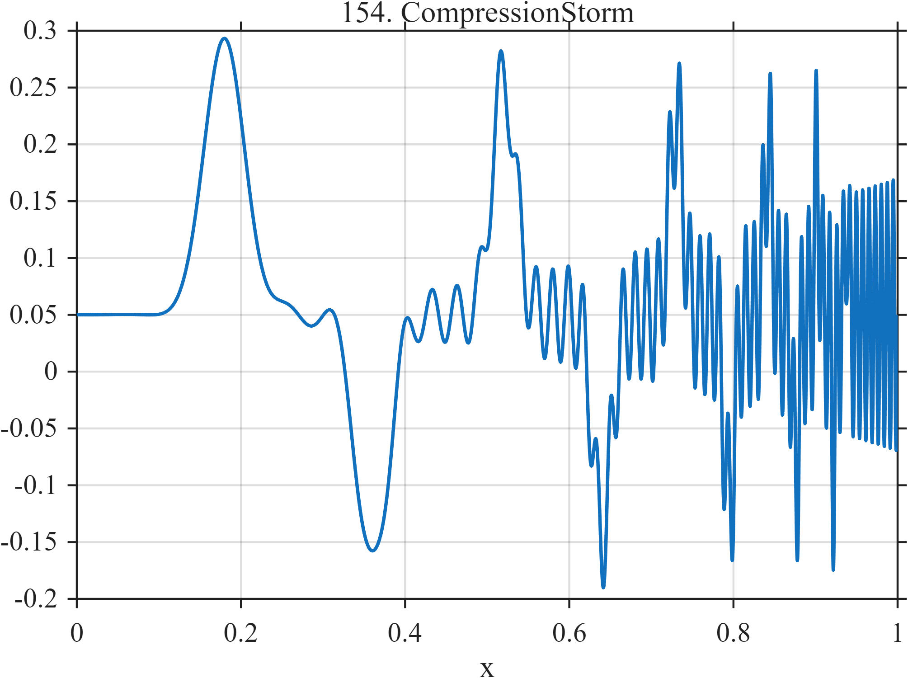

# TF154 — CompressionStorm

## Overview

The **CompressionStorm** stress test contains alternating events whose widths and spacing collapse toward the right boundary while an accelerating oscillation develops underneath.

## Mathematical Definition

Let $g(x;c,w)=e^{-((x-c)/w)^2/2}$ and

$$
c=(0.18,0.36,0.52,0.64,0.73,0.795,0.842,0.876,0.902,0.922,0.938).
$$

For $k=1,\ldots,11$, set $w_k=0.025(0.76)^{k-1}$ and $a_k=0.24(0.93)^{k-1}$. Then

$$
f(x)=0.05+\sum_{k=1}^{11}a_k(-1)^{k+1}g(x;c_k,w_k)
+0.12x^2\sin[2\pi(6x+45x^3)].
$$

## Morphological Characteristics

| Property | Description |
|---|---|
| Primary family | Compressed alternating peaks plus accelerating oscillation |
| Width contraction | Factor 0.76 per event |
| Amplitude contraction | Factor 0.93 per event |
| Main challenge | Event spacing and characteristic scale collapse simultaneously |

## Parameters

| Parameter | Meaning | Default |
|---|---|---:|
| $0.76$ | Width contraction | 0.76 |
| $0.93$ | Amplitude contraction | 0.93 |
| $45$ | Cubic phase coefficient | 45 |

## MATLAB Implementation

~~~matlab
N=1024; x=linspace(0,1,N); f=0.05*ones(size(x));
c=[0.18 0.36 0.52 0.64 0.73 0.795 0.842 0.876 0.902 0.922 0.938];
for k=1:numel(c)
    width=0.025*(0.76^(k-1)); amp=0.24*(0.93^(k-1));
    f=f+amp*(-1)^(k+1)*exp(-0.5*((x-c(k))/width).^2);
end
f=f+0.12*x.^2.*sin(2*pi*(6*x+45*x.^3));
plot(x,f); grid on; title('TF154 — CompressionStorm')
exportgraphics(gcf,'TF154_CompressionStorm.png','Resolution',300);
~~~

## Python Implementation

~~~python
import numpy as np
import matplotlib.pyplot as plt
N=1024; x=np.linspace(0,1,N); f=.05*np.ones_like(x)
c=[.18,.36,.52,.64,.73,.795,.842,.876,.902,.922,.938]
for k,ck in enumerate(c,start=1):
    width=.025*(.76**(k-1)); amp=.24*(.93**(k-1))
    f+=amp*((-1)**(k+1))*np.exp(-.5*((x-ck)/width)**2)
f+=.12*x**2*np.sin(2*np.pi*(6*x+45*x**3))
plt.plot(x,f); plt.grid(alpha=.3); plt.tight_layout()
plt.savefig('TF154_CompressionStorm.png',dpi=300)
~~~

## Recommended Uses

- Boundary-compression stress testing
- Shrinking-event resolution
- Accelerating-oscillation preservation

## Provenance

**Status:** Deliberately artificial MishMash stress test.

---

[← Previous: SymmetryBreak](TF153_SymmetryBreak.md) | [Category 8 Catalog](index.md) | [Next: GrandMishMash →](TF155_GrandMishMash.md)
