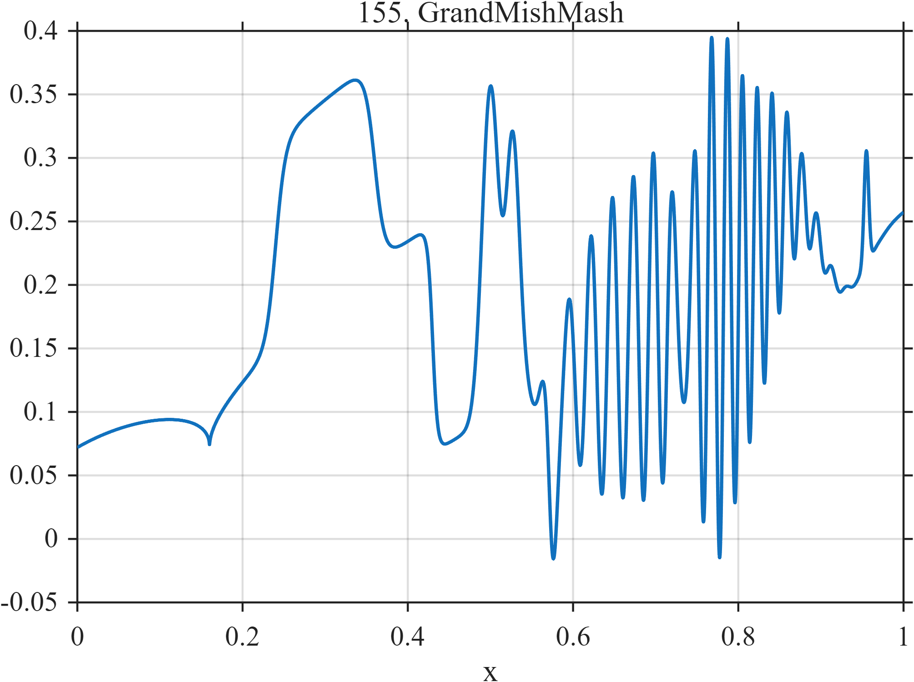

# TF155 — GrandMishMash

## Overview

The **GrandMishMash** is a compact final examination of local adaptivity, combining smooth curvature, a cusp, finite plateau, jump, close peaks, notch, localized chirp, wave packet, near-cancellation, and terminal needle.

## Mathematical Definition

Let $S(x;c,w)=[1+e^{-(x-c)/w}]^{-1}$ and $g(x;c,w)=e^{-((x-c)/w)^2/2}$. Then

$$
\begin{aligned}
f(x)={}&0.12x+0.08\log(1+6x)+0.18\sqrt{|x-0.16|}\\
&+0.16[S(x;0.24,0.006)-S(x;0.36,0.006)]-0.18S(x;0.43,0.003)\\
&+0.26g(x;0.50,0.010)+0.21g(x;0.527,0.008)-0.13g(x;0.575,0.005)\\
&+0.13\sin[2\pi(8x+24x^2)][S(x;0.60,0.02)-S(x;0.78,0.02)]\\
&+0.16g(x;0.80,0.045)\sin(110\pi x)\\
&+0.28g(x;0.885,0.035)-0.26g(x;0.895,0.037)+0.09g(x;0.955,0.0028).
\end{aligned}
$$

## Morphological Characteristics

| Property | Description |
|---|---|
| Primary family | Comprehensive mixed-geometry stress test |
| Middle structure | Plateau, jump, doublet, notch, and localized chirp |
| Terminal structure | Wave packet, near-cancellation, and very narrow needle |
| Main challenge | Local adaptation across essentially incompatible geometries |

## Parameters

| Parameter | Meaning | Default |
|---|---|---:|
| $0.24,0.36$ | Plateau boundaries | As shown |
| $0.50,0.527,0.575$ | Peak/notch centers | As shown |
| $0.0028$ | Terminal-needle width | 0.0028 |

## MATLAB Implementation

~~~matlab
N=1024; x=linspace(0,1,N); S=@(z,c,w) 1./(1+exp(-(z-c)/w));
f=0.12*x+0.08*log(1+6*x)+0.18*sqrt(abs(x-0.16));
f=f+0.16*(S(x,0.24,0.006)-S(x,0.36,0.006))-0.18*S(x,0.43,0.003);
f=f+0.26*exp(-0.5*((x-0.50)/0.010).^2)+0.21*exp(-0.5*((x-0.527)/0.008).^2) ...
 -0.13*exp(-0.5*((x-0.575)/0.005).^2);
f=f+0.13*sin(2*pi*(8*x+24*x.^2)).*(S(x,0.60,0.02)-S(x,0.78,0.02));
f=f+0.16*exp(-0.5*((x-0.80)/0.045).^2).*sin(2*pi*55*x);
f=f+0.28*exp(-0.5*((x-0.885)/0.035).^2)-0.26*exp(-0.5*((x-0.895)/0.037).^2) ...
 +0.09*exp(-0.5*((x-0.955)/0.0028).^2);
plot(x,f); grid on; title('TF155 — GrandMishMash')
exportgraphics(gcf,'TF155_GrandMishMash.png','Resolution',300);
~~~

## Python Implementation

~~~python
import numpy as np
import matplotlib.pyplot as plt
N=1024; x=np.linspace(0,1,N); S=lambda c,w: 1/(1+np.exp(-(x-c)/w)); g=lambda c,w: np.exp(-.5*((x-c)/w)**2)
f=.12*x+.08*np.log(1+6*x)+.18*np.sqrt(np.abs(x-.16))
f+=.16*(S(.24,.006)-S(.36,.006))-.18*S(.43,.003)
f+=.26*g(.50,.010)+.21*g(.527,.008)-.13*g(.575,.005)
f+=.13*np.sin(2*np.pi*(8*x+24*x**2))*(S(.60,.02)-S(.78,.02))
f+=.16*g(.80,.045)*np.sin(2*np.pi*55*x)
f+=.28*g(.885,.035)-.26*g(.895,.037)+.09*g(.955,.0028)
plt.plot(x,f); plt.grid(alpha=.3); plt.tight_layout()
plt.savefig('TF155_GrandMishMash.png',dpi=300)
~~~

## Recommended Uses

- Comprehensive local-adaptivity testing
- Multiscale feature preservation
- Global-error limitation studies

## Provenance

**Status:** Deliberately artificial GrandMishMash stress test.

---

[← Previous: CompressionStorm](TF154_CompressionStorm.md) | [Category 8 Catalog](index.md) | Next: end of Category 8
