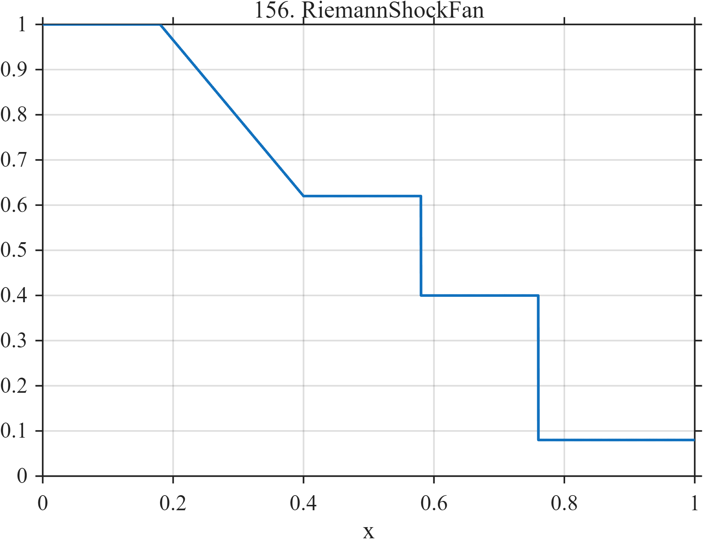

# TF156 — RiemannShockFan

## Overview

The **RiemannShockFan** signal combines constant states, a continuous rarefaction fan, a contact-like jump, another plateau, and a final shock.

## Mathematical Definition

$$
f(x)=
\begin{cases}
1, & 0\le x<0.18,\\
1-0.38\dfrac{x-0.18}{0.22}, & 0.18\le x<0.40,\\
0.62, & 0.40\le x<0.58,\\
0.40, & 0.58\le x<0.76,\\
0.08, & 0.76\le x\le1.
\end{cases}
$$

## Morphological Characteristics

| Property | Description |
|---|---|
| Primary family | Flat states, linear fan, and two jumps |
| Rarefaction | Continuous decline over 0.18–0.40 |
| Discontinuities | At $x=0.58$ and $x=0.76$ |
| Main challenge | Preserving shocks without turning the fan into a staircase |

## Parameters

| Parameter | Meaning | Default |
|---|---|---:|
| $0.18,0.40$ | Rarefaction boundaries | As shown |
| $0.58$ | Contact-like jump | 0.58 |
| $0.76$ | Final shock | 0.76 |

## MATLAB Implementation

~~~matlab
N=1024; x=linspace(0,1,N); f=zeros(size(x));
m1=x<0.18; m2=x>=0.18 & x<0.40; m3=x>=0.40 & x<0.58;
m4=x>=0.58 & x<0.76; m5=x>=0.76;
f(m1)=1.00;
f(m2)=1.00-0.38*(x(m2)-0.18)/(0.40-0.18);
f(m3)=0.62; f(m4)=0.40; f(m5)=0.08;
plot(x,f); grid on; title('TF156 — RiemannShockFan')
exportgraphics(gcf,'TF156_RiemannShockFan.png','Resolution',300);
~~~

## Python Implementation

~~~python
import numpy as np
import matplotlib.pyplot as plt
N=1024; x=np.linspace(0,1,N); f=np.zeros_like(x)
f[x<.18]=1.00
m=(x>=.18)&(x<.40); f[m]=1-.38*(x[m]-.18)/(.40-.18)
f[(x>=.40)&(x<.58)]=.62; f[(x>=.58)&(x<.76)]=.40; f[x>=.76]=.08
plt.plot(x,f); plt.grid(alpha=.3); plt.tight_layout()
plt.savefig('TF156_RiemannShockFan.png',dpi=300)
~~~

## Recommended Uses

- Shock-preserving denoising
- Mixed-regularity recovery
- Rarefaction-versus-step evaluation

## Provenance

**Status:** Riemann-problem-inspired deterministic compressible-flow surrogate.

---

[Category 9 Catalog](index.md) | [Next: DispersiveHydraulicJump →](TF157_DispersiveHydraulicJump.md)
