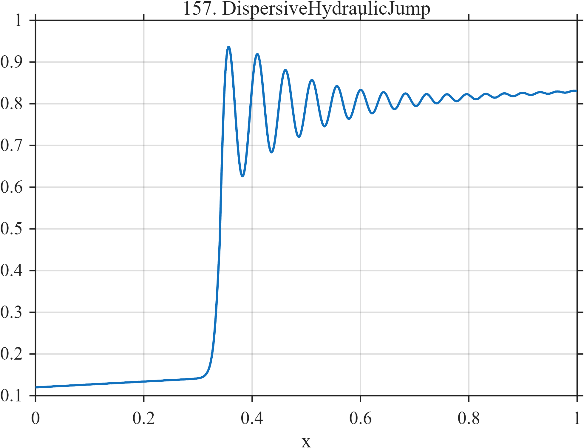

# TF157 — DispersiveHydraulicJump

## Overview

The **DispersiveHydraulicJump** signal contains a steep front followed by a genuine decaying, changing-frequency dispersive wavetrain.

## Mathematical Definition

Let $S(x;c,w)=[1+e^{-(x-c)/w}]^{-1}$ and $u=(x-0.34)_+$. Then

$$
f(x)=0.12+0.07x+0.64S(x;0.34,0.006)
+0.22I(x\ge0.34)e^{-7.5u}\sin[2\pi(17u+12u^2)].
$$

## Morphological Characteristics

| Property | Description |
|---|---|
| Primary family | Steep transition with dispersive wavetrain |
| Front | Near $x=0.34$ |
| Post-front structure | Decaying chirped oscillation |
| Main challenge | Avoiding removal of genuine waves as estimator ringing |

## Parameters

| Parameter | Meaning | Default |
|---|---|---:|
| $0.64$ | Jump magnitude | 0.64 |
| $7.5$ | Wavetrain decay rate | 7.5 |
| $12$ | Quadratic phase coefficient | 12 |

## MATLAB Implementation

~~~matlab
N=1024; x=linspace(0,1,N); S=@(z,c,w) 1./(1+exp(-(z-c)/w));
u=max(x-0.34,0); f=0.12+0.07*x+0.64*S(x,0.34,0.006);
f=f+(x>=0.34).*0.22.*exp(-7.5*u).*sin(2*pi*(17*u+12*u.^2));
plot(x,f); grid on; title('TF157 — DispersiveHydraulicJump')
exportgraphics(gcf,'TF157_DispersiveHydraulicJump.png','Resolution',300);
~~~

## Python Implementation

~~~python
import numpy as np
import matplotlib.pyplot as plt
N=1024; x=np.linspace(0,1,N); S=lambda c,w: 1/(1+np.exp(-(x-c)/w)); u=np.maximum(x-.34,0)
f=.12+.07*x+.64*S(.34,.006)
f+=(x>=.34)*.22*np.exp(-7.5*u)*np.sin(2*np.pi*(17*u+12*u**2))
plt.plot(x,f); plt.grid(alpha=.3); plt.tight_layout()
plt.savefig('TF157_DispersiveHydraulicJump.png',dpi=300)
~~~

## Recommended Uses

- Dispersive-front denoising
- Genuine-ringing preservation
- Phase-coherent tail recovery

## Provenance

**Status:** Dispersive-hydraulic-jump-inspired deterministic surrogate.

---

[← Previous: RiemannShockFan](TF156_RiemannShockFan.md) | [Category 9 Catalog](index.md) | [Next: XAFSEdge →](TF158_XAFSEdge.md)
