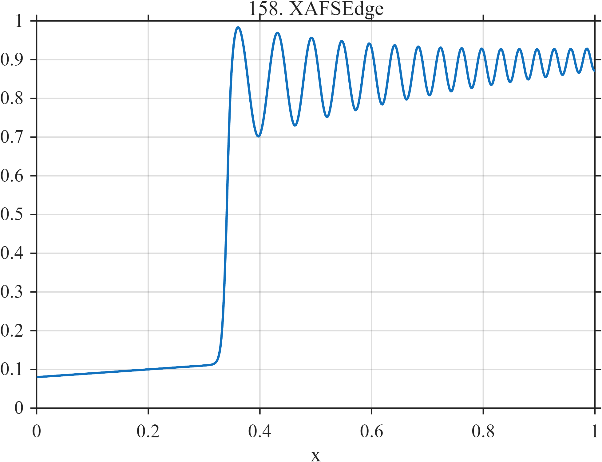

# TF158 — XAFSEdge

## Overview

The **XAFSEdge** signal combines a smooth pre-edge background, sharp absorption edge, and weaker decaying post-edge oscillations with changing frequency.

## Mathematical Definition

Let $S(x;c,w)=[1+e^{-(x-c)/w}]^{-1}$ and $u=(x-0.34)_+$. Then

$$
f(x)=0.08+0.10x+0.72S(x;0.34,0.004)
+0.16I(x\ge0.34)e^{-2.6u}\sin[2\pi(12u+18u^2)].
$$

## Morphological Characteristics

| Property | Description |
|---|---|
| Primary family | Dominant edge with coherent oscillatory tail |
| Absorption edge | Near $x=0.34$ |
| Fine structure | Slowly decaying chirped oscillation |
| Main challenge | Preserving weak post-edge information beside a large transition |

## Parameters

| Parameter | Meaning | Default |
|---|---|---:|
| $0.72$ | Edge magnitude | 0.72 |
| $2.6$ | Tail decay rate | 2.6 |
| $18$ | Quadratic phase coefficient | 18 |

## MATLAB Implementation

~~~matlab
N=1024; x=linspace(0,1,N); S=@(z,c,w) 1./(1+exp(-(z-c)/w));
u=max(x-0.34,0); f=0.08+0.10*x+0.72*S(x,0.34,0.004);
f=f+(x>=0.34).*0.16.*exp(-2.6*u).*sin(2*pi*(12*u+18*u.^2));
plot(x,f); grid on; title('TF158 — XAFSEdge')
exportgraphics(gcf,'TF158_XAFSEdge.png','Resolution',300);
~~~

## Python Implementation

~~~python
import numpy as np
import matplotlib.pyplot as plt
N=1024; x=np.linspace(0,1,N); S=lambda c,w: 1/(1+np.exp(-(x-c)/w)); u=np.maximum(x-.34,0)
f=.08+.10*x+.72*S(.34,.004)
f+=(x>=.34)*.16*np.exp(-2.6*u)*np.sin(2*np.pi*(12*u+18*u**2))
plt.plot(x,f); plt.grid(alpha=.3); plt.tight_layout()
plt.savefig('TF158_XAFSEdge.png',dpi=300)
~~~

## Recommended Uses

- XAFS-spectrum denoising
- Edge localization
- Post-edge oscillation preservation

## Provenance

**Status:** X-ray-absorption-fine-structure-inspired deterministic surrogate.

---

[← Previous: DispersiveHydraulicJump](TF157_DispersiveHydraulicJump.md) | [Category 9 Catalog](index.md) | [Next: QuantumHallPlateaus →](TF159_QuantumHallPlateaus.md)
