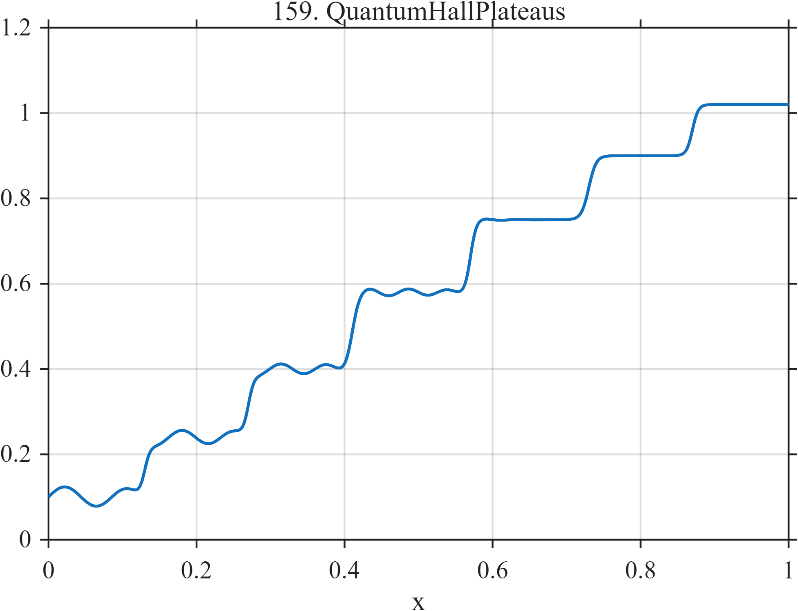

# TF159 — QuantumHallPlateaus

## Overview

The **QuantumHallPlateaus** signal is a smooth staircase of nearly constant plateaus with weak decaying oscillatory structure over the early and middle record.

## Mathematical Definition

Let $S(x;c,w)=[1+e^{-(x-c)/w}]^{-1}$. Then

$$
f(x)=0.10+\sum_{k=1}^{6}a_kS(x;c_k,w_k)
+0.025e^{-2.4x}\sin[2\pi(11x+8x^2)][1-S(x;0.58,0.025)],
$$

where

$$
c=(0.13,0.27,0.41,0.57,0.73,0.87),
$$

$$
a=(0.14,0.16,0.18,0.17,0.15,0.12),\quad
w=(0.004,0.004,0.005,0.004,0.005,0.004).
$$

## Morphological Characteristics

| Property | Description |
|---|---|
| Primary family | Smooth staircase with weak oscillation |
| Plateaus | Six narrow transitions |
| Oscillation | Decays and is gated off near $x=0.58$ |
| Main challenge | Preserving plateau flatness, transition locations, and weak oscillation |

## Parameters

| Parameter | Meaning | Default |
|---|---|---:|
| $c_k,a_k,w_k$ | Transition centers, heights, and widths | As above |
| $0.025$ | Oscillation amplitude | 0.025 |

## MATLAB Implementation

~~~matlab
N=1024; x=linspace(0,1,N); S=@(z,c,w) 1./(1+exp(-(z-c)/w)); f=0.10*ones(size(x));
c=[0.13 0.27 0.41 0.57 0.73 0.87]; a=[0.14 0.16 0.18 0.17 0.15 0.12];
w=[0.004 0.004 0.005 0.004 0.005 0.004];
for k=1:numel(c), f=f+a(k)*S(x,c(k),w(k)); end
f=f+0.025*exp(-2.4*x).*sin(2*pi*(11*x+8*x.^2)).*(1-S(x,0.58,0.025));
plot(x,f); grid on; title('TF159 — QuantumHallPlateaus')
exportgraphics(gcf,'TF159_QuantumHallPlateaus.png','Resolution',300);
~~~

## Python Implementation

~~~python
import numpy as np
import matplotlib.pyplot as plt
N=1024; x=np.linspace(0,1,N); S=lambda c,w: 1/(1+np.exp(-(x-c)/w)); f=.10*np.ones_like(x)
c=[.13,.27,.41,.57,.73,.87]; a=[.14,.16,.18,.17,.15,.12]; w=[.004,.004,.005,.004,.005,.004]
for ck,ak,wk in zip(c,a,w): f+=ak*S(ck,wk)
f+=.025*np.exp(-2.4*x)*np.sin(2*np.pi*(11*x+8*x**2))*(1-S(.58,.025))
plt.plot(x,f); plt.grid(alpha=.3); plt.tight_layout()
plt.savefig('TF159_QuantumHallPlateaus.png',dpi=300)
~~~

## Recommended Uses

- Plateau-preserving denoising
- Transition localization
- Weak magneto-oscillation recovery

## Provenance

**Status:** Quantum-Hall-transport-inspired deterministic surrogate.

---

[← Previous: XAFSEdge](TF158_XAFSEdge.md) | [Category 9 Catalog](index.md) | [Next: FresnelOccultation →](TF160_FresnelOccultation.md)
