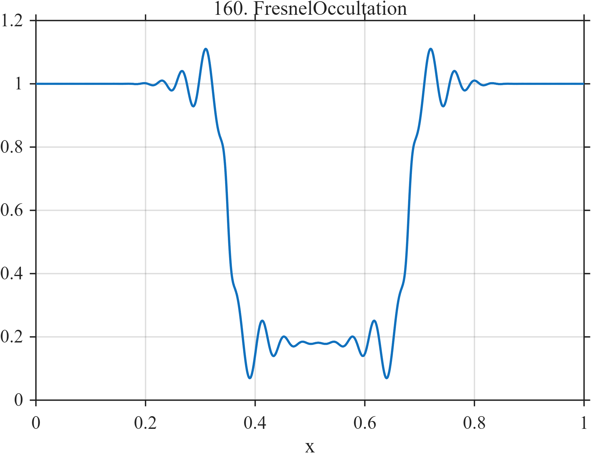

# TF160 — FresnelOccultation

## Overview

The **FresnelOccultation** signal contains a finite intensity depression with localized, physically meaningful Fresnel-like fringes at ingress and egress.

## Mathematical Definition

Let $S(x;c,w)=[1+e^{-(x-c)/w}]^{-1}$, $c_1=0.35$, $c_2=0.68$, and $s_1=1$, $s_2=-1$. Then

$$
\begin{aligned}
f(x)={}&1-0.82[S(x;0.35,0.004)-S(x;0.68,0.004)]\\
&+\sum_{k=1}^{2}0.15s_k e^{-\frac12((x-c_k)/0.052)^2}
\sin\{2\pi[16(x-c_k)+55(x-c_k)|x-c_k|]\}.
\end{aligned}
$$

## Morphological Characteristics

| Property | Description |
|---|---|
| Primary family | Finite occultation with boundary fringes |
| Occulted interval | Approximately 0.35–0.68 |
| Edge structure | Oppositely signed chirped fringe packets |
| Main challenge | Distinguishing physical interference from artificial ringing |

## Parameters

| Parameter | Meaning | Default |
|---|---|---:|
| $0.82$ | Occultation depth | 0.82 |
| $0.052$ | Fringe envelope width | 0.052 |
| $55$ | Nonlinear fringe-phase coefficient | 55 |

## MATLAB Implementation

~~~matlab
N=1024; x=linspace(0,1,N); S=@(z,c,w) 1./(1+exp(-(z-c)/w));
f=1-0.82*(S(x,0.35,0.004)-S(x,0.68,0.004));
c=[0.35 0.68]; signs=[1 -1];
for k=1:2
    u=x-c(k);
    f=f+signs(k)*0.15*exp(-0.5*(u/0.052).^2).*sin(2*pi*(16*u+55*u.*abs(u)));
end
plot(x,f); grid on; title('TF160 — FresnelOccultation')
exportgraphics(gcf,'TF160_FresnelOccultation.png','Resolution',300);
~~~

## Python Implementation

~~~python
import numpy as np
import matplotlib.pyplot as plt
N=1024; x=np.linspace(0,1,N); S=lambda c,w: 1/(1+np.exp(-(x-c)/w))
f=1-.82*(S(.35,.004)-S(.68,.004))
for c,sign in zip([.35,.68],[1,-1]):
    u=x-c; f+=sign*.15*np.exp(-.5*(u/.052)**2)*np.sin(2*np.pi*(16*u+55*u*np.abs(u)))
plt.plot(x,f); plt.grid(alpha=.3); plt.tight_layout()
plt.savefig('TF160_FresnelOccultation.png',dpi=300)
~~~

## Recommended Uses

- Occultation-curve denoising
- Edge-associated fringe preservation
- Physical-versus-artificial ringing assessment

## Provenance

**Status:** Fresnel-occultation-inspired deterministic surrogate.

---

[← Previous: QuantumHallPlateaus](TF159_QuantumHallPlateaus.md) | [Category 9 Catalog](index.md) | [Next: CapnogramBreaths →](TF161_CapnogramBreaths.md)
