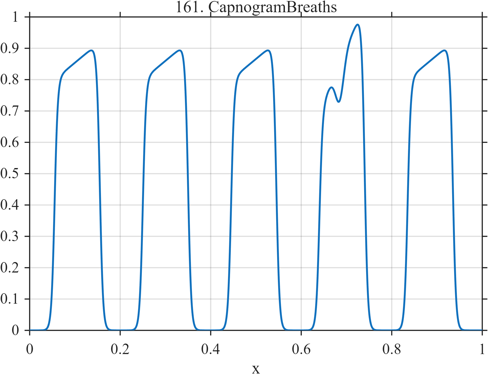

# TF161 — Capnogram Breaths

## Overview

This deterministic capnogram surrogate contains five repeated breaths. Each breath has a rapid expiratory upstroke, a sloping alveolar plateau, and a rapid inspiratory return. The fourth breath has a stronger shark-fin slope and a localized cleft, providing a small pathological departure from the repeated morphology.

## Mathematical Definition

Define the smooth logistic transition

$$
L(x;c,w)=\frac{1}{1+\exp\{-(x-c)/w\}}.
$$

For breath starts

$$
t=(0.010,0.205,0.400,0.595,0.790),
$$

let $r_k=t_k+0.045$, $d_k=t_k+0.145$, and

$$
G_k(x)=L(x;r_k,0.0035)-L(x;d_k,0.0035).
$$

The plateau slopes are

$$
p_k(x)=0.80+0.12\frac{x-r_k}{d_k-r_k},\qquad k\ne4,
$$

and

$$
p_4(x)=0.70+0.34\frac{x-r_4}{d_4-r_4}.
$$

The signal is

$$
f(x)=\sum_{k=1}^{5}G_k(x)p_k(x)
-0.12\exp\left[-\frac12\left(\frac{x-0.685}{0.009}\right)^2\right],
\qquad 0\le x\le1.
$$

## Morphological Characteristics

| Property | Description |
|---|---|
| Primary family | Recurrent pulse morphology |
| Signal type | Smooth gated plateaus with a localized defect |
| Main structure | Five repeated capnogram breaths |
| Local anomaly | Shark-fin fourth plateau and small cleft |
| Main challenge | Preserve a weak abnormality within repeated structure |

## Parameters

| Parameter | Value | Meaning |
|---|---:|---|
| $t_k$ | listed above | Breath start times |
| Rise offset | $0.045$ | Start-to-upstroke delay |
| Fall offset | $0.145$ | Start-to-downstroke delay |
| Gate width | $0.0035$ | Transition smoothness |
| Cleft center | $0.685$ | Location of the localized depression |

## MATLAB Implementation

~~~matlab
N = 1024;
x = linspace(0,1,N);
S = @(z,c,w) 1./(1+exp(-(z-c)/w));

f = zeros(size(x));
starts = [0.01 0.205 0.400 0.595 0.790];
for k = 1:numel(starts)
    rise = starts(k) + 0.045;
    fall = starts(k) + 0.145;
    gate = S(x,rise,0.0035) - S(x,fall,0.0035);
    slope = 0.80 + 0.12*(x-rise)/(fall-rise);
    if k == 4
        slope = 0.70 + 0.34*(x-rise)/(fall-rise);
    end
    f = f + gate.*slope;
end
f = f - 0.12*exp(-0.5*((x-0.685)/0.009).^2);

plot(x,f,'LineWidth',1.5); grid on
xlabel('x'); ylabel('f(x)'); title('TF161 — Capnogram Breaths')
~~~

## Python Implementation

~~~python
import numpy as np
import matplotlib.pyplot as plt

N = 1024
x = np.linspace(0.0, 1.0, N)
S = lambda z, c, w: 1.0 / (1.0 + np.exp(-(z - c) / w))

f = np.zeros_like(x)
starts = np.array([0.010, 0.205, 0.400, 0.595, 0.790])
for k, start in enumerate(starts, start=1):
    rise, fall = start + 0.045, start + 0.145
    gate = S(x, rise, 0.0035) - S(x, fall, 0.0035)
    slope = 0.80 + 0.12 * (x - rise) / (fall - rise)
    if k == 4:
        slope = 0.70 + 0.34 * (x - rise) / (fall - rise)
    f += gate * slope
f -= 0.12 * np.exp(-0.5 * ((x - 0.685) / 0.009) ** 2)

plt.plot(x, f)
plt.xlabel("x"); plt.ylabel("f(x)"); plt.title("TF161 — Capnogram Breaths")
plt.grid(True); plt.show()
~~~

## Recommended Uses

- Recurrent pulse denoising
- Preservation of plateau slopes and fast transitions
- Detection of a weak local defect in a periodic record

## Provenance

This is a deterministic, application-oriented surrogate inspired by time-domain capnography. It is not a physiological simulator or a clinical reference trace.

[← Previous: Fresnel Occultation](TF160_FresnelOccultation.md) · [Category 9 catalog](index.md) · [Next: Diffusion MRI IVIM →](TF162_DiffusionMRIIVIM.md)
