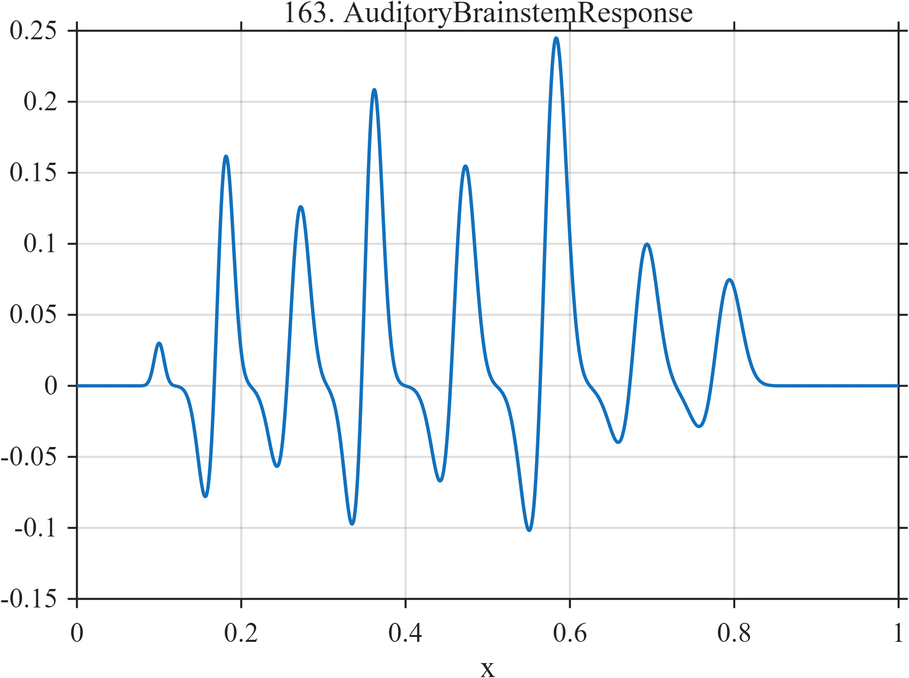

# TF163 — Auditory Brainstem Response

## Overview

This signal is a sequence of small, alternating negative-positive wave complexes inspired by an auditory brainstem response. The landmarks have unequal amplitudes and widths, and a very weak early component tests preservation of low-amplitude latency information.

## Mathematical Definition

Let

$$
g(x;\mu,w)=\exp\left[-\frac12\left(\frac{x-\mu}{w}\right)^2\right].
$$

With

$$
\mu=(0.18,0.27,0.36,0.47,0.58,0.69,0.79),
$$

$$
a=(0.18,0.15,0.24,0.19,0.31,0.13,0.10),
$$

and

$$
w=(0.010,0.012,0.011,0.013,0.014,0.015,0.016),
$$

the signal is

$$
f(x)=\sum_{k=1}^{7}a_k\left[g(x;\mu_k,w_k)-0.52g(x;\mu_k-0.020,1.15w_k)\right]
+0.03g(x;0.10,0.006).
$$

## Morphological Characteristics

| Property | Description |
|---|---|
| Primary family | Sparse multipeak transient |
| Signal type | Alternating Gaussian components |
| Structure | Seven unequal response landmarks |
| Weak feature | Small early peak near $x=0.10$ |
| Main challenge | Preserve latency, polarity, and unequal peak amplitudes |

## Parameters

| Parameter | Value | Meaning |
|---|---|---|
| $\mu_k$ | listed above | Positive-peak centers |
| $a_k$ | listed above | Positive-peak amplitudes |
| $w_k$ | listed above | Positive-peak widths |
| Negative offset | $0.020$ | Preceding trough displacement |
| Negative scale | $0.52$ | Trough-to-peak amplitude ratio |

## MATLAB Implementation

~~~matlab
N = 1024;
x = linspace(0,1,N);
f = zeros(size(x));
mu = [0.18 0.27 0.36 0.47 0.58 0.69 0.79];
a  = [0.18 0.15 0.24 0.19 0.31 0.13 0.10];
w  = [0.010 0.012 0.011 0.013 0.014 0.015 0.016];
for k = 1:numel(mu)
    f = f + a(k)*exp(-0.5*((x-mu(k))/w(k)).^2) ...
          - 0.52*a(k)*exp(-0.5*((x-(mu(k)-0.020))/(1.15*w(k))).^2);
end
f = f + 0.03*exp(-0.5*((x-0.10)/0.006).^2);

plot(x,f,'LineWidth',1.5); grid on
xlabel('x'); ylabel('f(x)'); title('TF163 — Auditory Brainstem Response')
~~~

## Python Implementation

~~~python
import numpy as np
import matplotlib.pyplot as plt

N = 1024
x = np.linspace(0.0, 1.0, N)
mu = np.array([0.18, 0.27, 0.36, 0.47, 0.58, 0.69, 0.79])
a = np.array([0.18, 0.15, 0.24, 0.19, 0.31, 0.13, 0.10])
w = np.array([0.010, 0.012, 0.011, 0.013, 0.014, 0.015, 0.016])
f = np.zeros_like(x)
for center, amp, width in zip(mu, a, w):
    f += amp * np.exp(-0.5 * ((x - center) / width) ** 2)
    f -= 0.52 * amp * np.exp(-0.5 * ((x - (center - 0.020)) / (1.15 * width)) ** 2)
f += 0.03 * np.exp(-0.5 * ((x - 0.10) / 0.006) ** 2)

plt.plot(x, f)
plt.xlabel("x"); plt.ylabel("f(x)"); plt.title("TF163 — Auditory Brainstem Response")
plt.grid(True); plt.show()
~~~

## Recommended Uses

- Small transient and latency preservation
- Unequal peak recovery
- Biomedical evoked-response denoising

## Provenance

This deterministic waveform is inspired by qualitative ABR morphology. It is not patient data and is not intended for diagnosis.

[← Previous: Diffusion MRI IVIM](TF162_DiffusionMRIIVIM.md) · [Category 9 catalog](index.md) · [Next: T-Wave Alternans →](TF164_TWaveAlternans.md)
