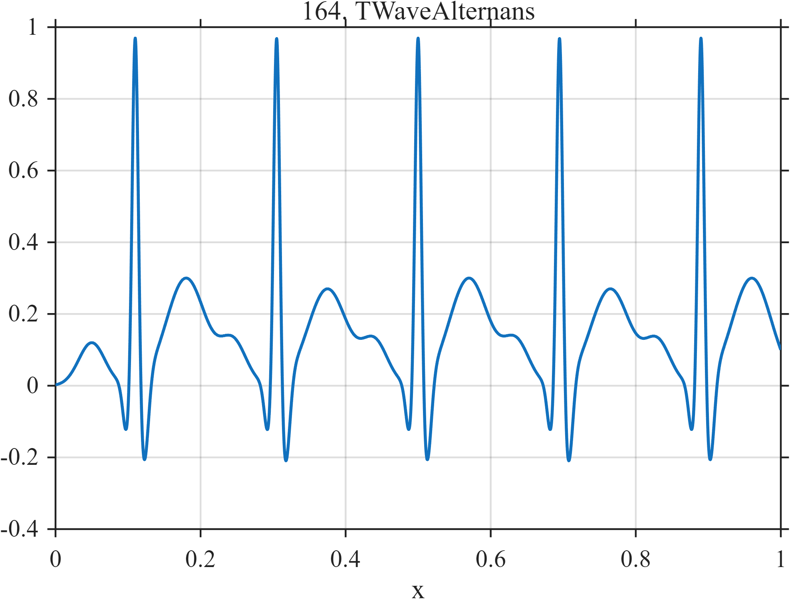

# TF164 — T-Wave Alternans

## Overview

Five idealized cardiac beats share the same P–QRS structure, while successive T waves alternate subtly in amplitude. The small beat-to-beat difference is scientifically meaningful but easily lost when the sharp R peaks dominate a global error criterion.

## Mathematical Definition

Let

$$
g(x;\mu,w)=\exp\left[-\frac12\left(\frac{x-\mu}{w}\right)^2\right].
$$

For R-wave centers

$$
r=(0.110,0.305,0.500,0.695,0.890)
$$

and alternating T-wave amplitudes

$$
A=(0.300,0.270,0.300,0.270,0.300),
$$

define

$$
\begin{aligned}
f(x)=\sum_{k=1}^{5}\big[&0.12g(x;r_k-0.060,0.018)
-0.14g(x;r_k-0.012,0.0050)\\
&+g(x;r_k,0.0042)-0.25g(x;r_k+0.012,0.0060)
+A_k g(x;r_k+0.070,0.027)\big].
\end{aligned}
$$

## Morphological Characteristics

| Property | Description |
|---|---|
| Primary family | Repeated multiscale pulses |
| Signal type | Gaussian P–QRS–T components |
| Dominant feature | Narrow unit-amplitude R waves |
| Weak feature | Alternating T-wave amplitudes $0.30$ and $0.27$ |
| Main challenge | Preserve subtle alternation next to sharp dominant peaks |

## Parameters

| Parameter | Value | Meaning |
|---|---|---|
| $r_k$ | listed above | R-wave centers |
| $A_k$ | listed above | T-wave amplitudes |
| T-wave offset | $0.070$ | Displacement from R wave |
| T-wave width | $0.027$ | Broad T-wave scale |

## MATLAB Implementation

~~~matlab
N = 1024;
x = linspace(0,1,N);
f = zeros(size(x));
r = [0.11 0.305 0.500 0.695 0.890];
tAmp = [0.30 0.270 0.30 0.270 0.30];
for k = 1:numel(r)
    rc = r(k);
    f = f + 0.12*exp(-0.5*((x-(rc-0.060))/0.018).^2) ...
          - 0.14*exp(-0.5*((x-(rc-0.012))/0.0050).^2) ...
          + 1.00*exp(-0.5*((x-rc)/0.0042).^2) ...
          - 0.25*exp(-0.5*((x-(rc+0.012))/0.0060).^2) ...
          + tAmp(k)*exp(-0.5*((x-(rc+0.070))/0.027).^2);
end

plot(x,f,'LineWidth',1.5); grid on
xlabel('x'); ylabel('f(x)'); title('TF164 — T-Wave Alternans')
~~~

## Python Implementation

~~~python
import numpy as np
import matplotlib.pyplot as plt

N = 1024
x = np.linspace(0.0, 1.0, N)
r = np.array([0.110, 0.305, 0.500, 0.695, 0.890])
t_amp = np.array([0.300, 0.270, 0.300, 0.270, 0.300])
f = np.zeros_like(x)
for rc, ta in zip(r, t_amp):
    f += 0.12 * np.exp(-0.5 * ((x - (rc - 0.060)) / 0.018) ** 2)
    f -= 0.14 * np.exp(-0.5 * ((x - (rc - 0.012)) / 0.0050) ** 2)
    f += np.exp(-0.5 * ((x - rc) / 0.0042) ** 2)
    f -= 0.25 * np.exp(-0.5 * ((x - (rc + 0.012)) / 0.0060) ** 2)
    f += ta * np.exp(-0.5 * ((x - (rc + 0.070)) / 0.027) ** 2)

plt.plot(x, f)
plt.xlabel("x"); plt.ylabel("f(x)"); plt.title("TF164 — T-Wave Alternans")
plt.grid(True); plt.show()
~~~

## Recommended Uses

- Preservation of weak beat-to-beat variation
- Multiscale cardiac-waveform denoising
- Testing error metrics dominated by narrow peaks

## Provenance

This is a deterministic ECG-inspired test function, not a clinical recording or diagnostic model.

[← Previous: Auditory Brainstem Response](TF163_AuditoryBrainstemResponse.md) · [Category 9 catalog](index.md) · [Next: Turbulence Intermittency →](TF165_TurbulenceIntermittency.md)
