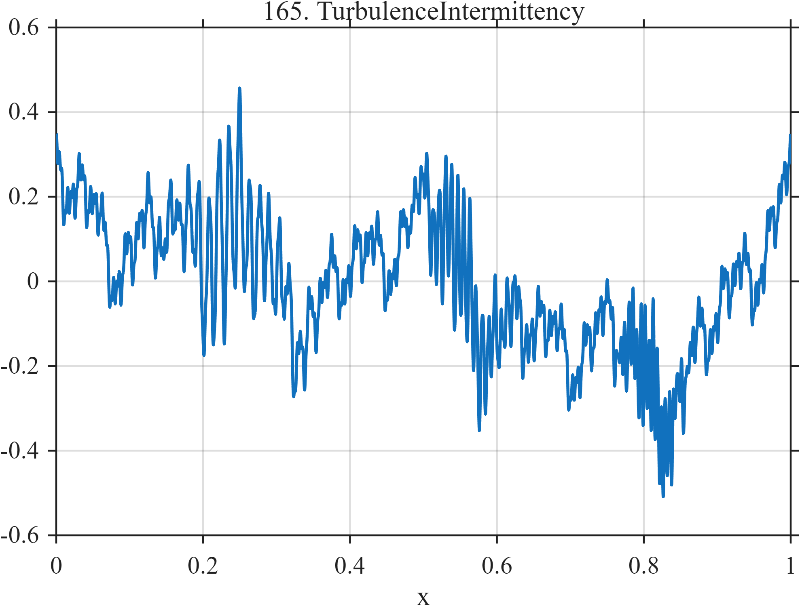

# TF165 — Turbulence Intermittency

## Overview

This deterministic turbulence surrogate combines a dyadic broadband background with three localized high-frequency packets. It moves between persistent multiscale fluctuation and intermittent fine-scale activity, challenging methods that equate weak high-frequency structure with noise.

## Mathematical Definition

Let

$$
\theta=(0.2,1.1,2.0,0.7,2.7,1.6,0.4,2.3,1.3).
$$

The broadband component is

$$
B(x)=\sum_{m=0}^{8}0.13\,2^{-m/3}\sin(2\pi 2^m x+\theta_{m+1}).
$$

With the Gaussian envelope $g(x;c,w)=\exp[-\tfrac12((x-c)/w)^2]$, the full signal is

$$
\begin{aligned}
f(x)=B(x)
&+0.20g(x;0.24,0.055)\sin(2\pi73x+0.3)\\
&+0.16g(x;0.56,0.040)\sin(2\pi119x+1.1)\\
&+0.13g(x;0.81,0.028)\sin(2\pi181x+0.8).
\end{aligned}
$$

## Morphological Characteristics

| Property | Description |
|---|---|
| Primary family | Multiscale intermittent oscillation |
| Background | Nine dyadic sinusoidal scales |
| Local structure | Three shrinking high-frequency packets |
| Regularity | Smooth but strongly nonstationary |
| Main challenge | Retain intermittent fine scales while reducing noise |

## Parameters

| Feature | Center | Width | Frequency | Amplitude |
|---|---:|---:|---:|---:|
| Packet 1 | $0.24$ | $0.055$ | $73$ | $0.20$ |
| Packet 2 | $0.56$ | $0.040$ | $119$ | $0.16$ |
| Packet 3 | $0.81$ | $0.028$ | $181$ | $0.13$ |

## MATLAB Implementation

~~~matlab
N = 1024;
x = linspace(0,1,N);
f = zeros(size(x));
phase = [0.2 1.1 2.0 0.7 2.7 1.6 0.4 2.3 1.3];
for m = 0:8
    freq = 2^m;
    amp = 0.13*2^(-m/3);
    f = f + amp*sin(2*pi*freq*x + phase(m+1));
end
f = f + 0.20*exp(-0.5*((x-0.24)/0.055).^2).*sin(2*pi*73*x+0.3) ...
      + 0.16*exp(-0.5*((x-0.56)/0.040).^2).*sin(2*pi*119*x+1.1) ...
      + 0.13*exp(-0.5*((x-0.81)/0.028).^2).*sin(2*pi*181*x+0.8);

plot(x,f,'LineWidth',1.2); grid on
xlabel('x'); ylabel('f(x)'); title('TF165 — Turbulence Intermittency')
~~~

## Python Implementation

~~~python
import numpy as np
import matplotlib.pyplot as plt

N = 1024
x = np.linspace(0.0, 1.0, N)
phases = np.array([0.2, 1.1, 2.0, 0.7, 2.7, 1.6, 0.4, 2.3, 1.3])
f = np.zeros_like(x)
for m, phase in enumerate(phases):
    frequency = 2 ** m
    amplitude = 0.13 * 2 ** (-m / 3)
    f += amplitude * np.sin(2 * np.pi * frequency * x + phase)
f += 0.20 * np.exp(-0.5 * ((x - 0.24) / 0.055) ** 2) * np.sin(2 * np.pi * 73 * x + 0.3)
f += 0.16 * np.exp(-0.5 * ((x - 0.56) / 0.040) ** 2) * np.sin(2 * np.pi * 119 * x + 1.1)
f += 0.13 * np.exp(-0.5 * ((x - 0.81) / 0.028) ** 2) * np.sin(2 * np.pi * 181 * x + 0.8)

plt.plot(x, f)
plt.xlabel("x"); plt.ylabel("f(x)"); plt.title("TF165 — Turbulence Intermittency")
plt.grid(True); plt.show()
~~~

## Recommended Uses

- Multiscale denoising
- Intermittency and wave-packet preservation
- Stress testing scale-adaptive thresholds

## Provenance

This deterministic signal is inspired by qualitative intermittency in turbulent measurements. It is not a fluid-dynamical simulation.

[← Previous: T-Wave Alternans](TF164_TWaveAlternans.md) · [Category 9 catalog](index.md) · [Next: Stress–Strain Fracture →](TF166_StressStrainFracture.md)
