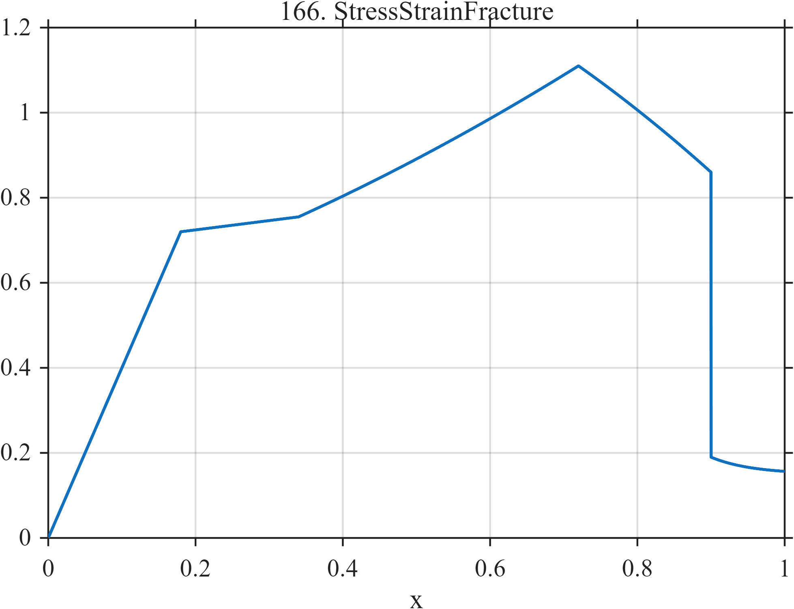

# TF166 — Stress–Strain Fracture

## Overview

This piecewise stress–strain surrogate moves through elastic loading, a short yield plateau, strain hardening, softening, and abrupt fracture. It combines slope changes with a large terminal discontinuity.

## Mathematical Definition

For $0\le x\le1$,

$$
f(x)=
\begin{cases}
4x, & x<0.18,\\
0.72+0.035\dfrac{x-0.18}{0.34-0.18}, & 0.18\le x<0.34,\\
0.755+0.30u+0.055u^2,\quad u=\dfrac{x-0.34}{0.72-0.34}, & 0.34\le x<0.72,\\
1.11-0.22v-0.03v^2,\quad v=\dfrac{x-0.72}{0.90-0.72}, & 0.72\le x<0.90,\\
0.15+0.04e^{-18(x-0.90)}, & x\ge0.90.
\end{cases}
$$

## Morphological Characteristics

| Property | Description |
|---|---|
| Primary family | Piecewise constitutive curve |
| Regimes | Elastic, yield, hardening, softening, fracture |
| Singular structure | Slope changes and terminal jump |
| Dominant event | Fracture at $x=0.90$ |
| Main challenge | Preserve both regime boundaries and the abrupt failure |

## Parameters

| Boundary | $0.18$ | $0.34$ | $0.72$ | $0.90$ |
|---|---:|---:|---:|---:|
| Interpretation | Yield onset | Hardening onset | Softening onset | Fracture |

## MATLAB Implementation

~~~matlab
N = 1024;
x = linspace(0,1,N);
f = zeros(size(x));
m1 = x < 0.18;
m2 = x >= 0.18 & x < 0.34;
m3 = x >= 0.34 & x < 0.72;
m4 = x >= 0.72 & x < 0.90;
m5 = x >= 0.90;
f(m1) = 4*x(m1);
f(m2) = 0.72 + 0.035*(x(m2)-0.18)/(0.34-0.18);
u = (x(m3)-0.34)/(0.72-0.34);
f(m3) = 0.755 + 0.30*u + 0.055*u.^2;
u = (x(m4)-0.72)/(0.90-0.72);
f(m4) = 1.11 - 0.22*u - 0.03*u.^2;
f(m5) = 0.15 + 0.04*exp(-18*(x(m5)-0.90));

plot(x,f,'LineWidth',1.5); grid on
xlabel('x'); ylabel('f(x)'); title('TF166 — Stress–Strain Fracture')
~~~

## Python Implementation

~~~python
import numpy as np
import matplotlib.pyplot as plt

N = 1024
x = np.linspace(0.0, 1.0, N)
f = np.zeros_like(x)
m1 = x < 0.18
m2 = (x >= 0.18) & (x < 0.34)
m3 = (x >= 0.34) & (x < 0.72)
m4 = (x >= 0.72) & (x < 0.90)
m5 = x >= 0.90
f[m1] = 4.0 * x[m1]
f[m2] = 0.72 + 0.035 * (x[m2] - 0.18) / (0.34 - 0.18)
u = (x[m3] - 0.34) / (0.72 - 0.34)
f[m3] = 0.755 + 0.30 * u + 0.055 * u**2
u = (x[m4] - 0.72) / (0.90 - 0.72)
f[m4] = 1.11 - 0.22 * u - 0.03 * u**2
f[m5] = 0.15 + 0.04 * np.exp(-18.0 * (x[m5] - 0.90))

plt.plot(x, f)
plt.xlabel("x"); plt.ylabel("f(x)"); plt.title("TF166 — Stress–Strain Fracture")
plt.grid(True); plt.show()
~~~

## Recommended Uses

- Edge and kink preservation
- Constitutive-curve smoothing
- Abrupt-failure localization

## Provenance

This deterministic curve is a qualitative materials-testing surrogate, not a calibrated constitutive law.

[← Previous: Turbulence Intermittency](TF165_TurbulenceIntermittency.md) · [Category 9 catalog](index.md) · [Next: Nanoindentation Pop-In →](TF167_NanoindentationPopIn.md)
