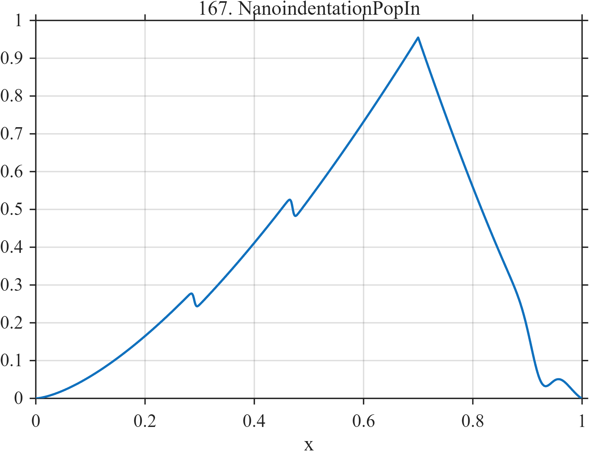

# TF167 — Nanoindentation Pop-In

## Overview

This loading–unloading curve contains nonlinear loading, two small pop-in events, a separate unloading branch, and a late adhesion-like depression. The weak discrete events sit on a much larger smooth background.

## Mathematical Definition

Define

$$
L(x;c,w)=\frac{1}{1+e^{-(x-c)/w}}.
$$

On the loading branch,

$$
f_L(x)=1.08\left(\frac{x}{0.70}\right)^{1.50}
-0.055L(x;0.29,0.0018)-0.070L(x;0.47,0.0018),
\qquad x\le0.70.
$$

Let $f_{70}$ be the value of the sampled loading curve nearest $x=0.70$. The unloading branch is

$$
f_U(x)=f_{70}\left(\frac{1-x}{0.30}\right)^{1.32},
\qquad x>0.70.
$$

Finally,

$$
f(x)=
\begin{cases}
f_L(x), & x\le0.70,\\
f_U(x), & x>0.70
\end{cases}
-0.11\exp\left[-\frac12\left(\frac{x-0.925}{0.018}\right)^2\right].
$$

## Morphological Characteristics

| Property | Description |
|---|---|
| Primary family | Hysteretic loading curve |
| Background | Smooth nonlinear loading and unloading |
| Local events | Two narrow pop-ins and a late adhesion dip |
| Junction | Branch change near $x=0.70$ |
| Main challenge | Preserve small abrupt events on a dominant trend |

## Parameters

| Parameter | Value | Meaning |
|---|---:|---|
| Pop-in centers | $0.29, 0.47$ | Loading discontinuities |
| Pop-in widths | $0.0018$ | Logistic transition widths |
| Branch point | $0.70$ | Loading-to-unloading transition |
| Adhesion center | $0.925$ | Late negative feature |

## MATLAB Implementation

~~~matlab
N = 1024;
x = linspace(0,1,N);
S = @(z,c,w) 1./(1+exp(-(z-c)/w));
f = zeros(size(x));
loadMask = x <= 0.70;
f(loadMask) = 1.08*(x(loadMask)/0.70).^1.50;
f(loadMask) = f(loadMask) ...
    - 0.055*S(x(loadMask),0.29,0.0018) ...
    - 0.070*S(x(loadMask),0.47,0.0018);
[~,i70] = min(abs(x-0.70));
f70 = f(i70);
unloadMask = x > 0.70;
f(unloadMask) = f70*((1-x(unloadMask))/0.30).^1.32;
f = f - 0.11*exp(-0.5*((x-0.925)/0.018).^2);

plot(x,f,'LineWidth',1.5); grid on
xlabel('x'); ylabel('f(x)'); title('TF167 — Nanoindentation Pop-In')
~~~

## Python Implementation

~~~python
import numpy as np
import matplotlib.pyplot as plt

N = 1024
x = np.linspace(0.0, 1.0, N)
S = lambda z, c, w: 1.0 / (1.0 + np.exp(-(z - c) / w))
f = np.zeros_like(x)
loading = x <= 0.70
f[loading] = 1.08 * (x[loading] / 0.70) ** 1.50
f[loading] -= 0.055 * S(x[loading], 0.29, 0.0018)
f[loading] -= 0.070 * S(x[loading], 0.47, 0.0018)
i70 = np.argmin(np.abs(x - 0.70))
f70 = f[i70]
unloading = x > 0.70
f[unloading] = f70 * ((1.0 - x[unloading]) / 0.30) ** 1.32
f -= 0.11 * np.exp(-0.5 * ((x - 0.925) / 0.018) ** 2)

plt.plot(x, f)
plt.xlabel("x"); plt.ylabel("f(x)"); plt.title("TF167 — Nanoindentation Pop-In")
plt.grid(True); plt.show()
~~~

## Recommended Uses

- Weak change-point preservation
- Hysteretic curve smoothing
- Small-event recovery on nonlinear trends

## Provenance

This deterministic signal is inspired by qualitative nanoindentation curves. It is not a material-specific contact model.

[← Previous: Stress–Strain Fracture](TF166_StressStrainFracture.md) · [Category 9 catalog](index.md) · [Next: DSC Phase Transitions →](TF168_DSCPhaseTransitions.md)
