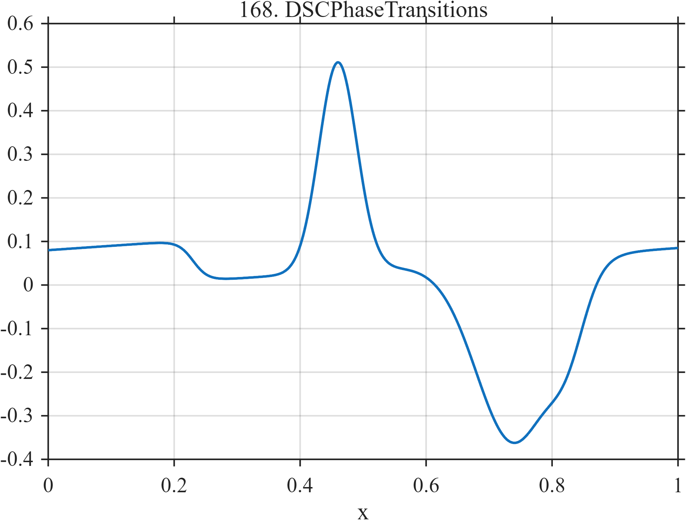

# TF168 — DSC Phase Transitions

## Overview

This differential-scanning-calorimetry surrogate combines baseline drift, a small heat-capacity step, and unequal positive and negative transition peaks. A weak secondary shoulder near the broad negative feature tests sensitivity to nearby low-amplitude structure.

## Mathematical Definition

With

$$
L(x;c,w)=\frac{1}{1+e^{-(x-c)/w}},
\qquad
g(x;c,w)=e^{-\frac12((x-c)/w)^2},
$$

the signal is

$$
f(x)=0.08+0.10x-0.095L(x;0.23,0.012)
+0.48g(x;0.46,0.030)-0.42g(x;0.74,0.060)
-0.12g(x;0.825,0.028).
$$

## Morphological Characteristics

| Property | Description |
|---|---|
| Primary family | Analytical transition profile |
| Background | Linear drift with a smooth step |
| Peaks | One narrow positive and two overlapping negative events |
| Scale mixture | Broad transition plus weak shoulder |
| Main challenge | Preserve signed peaks and nearby secondary structure |

## Parameters

| Feature | Center | Width | Amplitude |
|---|---:|---:|---:|
| Positive peak | $0.46$ | $0.030$ | $0.48$ |
| Broad negative peak | $0.74$ | $0.060$ | $-0.42$ |
| Negative shoulder | $0.825$ | $0.028$ | $-0.12$ |

## MATLAB Implementation

~~~matlab
N = 1024;
x = linspace(0,1,N);
S = @(z,c,w) 1./(1+exp(-(z-c)/w));
f = 0.08 + 0.10*x ...
    - 0.095*S(x,0.23,0.012) ...
    + 0.48*exp(-0.5*((x-0.46)/0.030).^2) ...
    - 0.42*exp(-0.5*((x-0.74)/0.060).^2) ...
    - 0.12*exp(-0.5*((x-0.825)/0.028).^2);

plot(x,f,'LineWidth',1.5); grid on
xlabel('x'); ylabel('f(x)'); title('TF168 — DSC Phase Transitions')
~~~

## Python Implementation

~~~python
import numpy as np
import matplotlib.pyplot as plt

N = 1024
x = np.linspace(0.0, 1.0, N)
S = lambda z, c, w: 1.0 / (1.0 + np.exp(-(z - c) / w))
f = 0.08 + 0.10 * x
f -= 0.095 * S(x, 0.23, 0.012)
f += 0.48 * np.exp(-0.5 * ((x - 0.46) / 0.030) ** 2)
f -= 0.42 * np.exp(-0.5 * ((x - 0.74) / 0.060) ** 2)
f -= 0.12 * np.exp(-0.5 * ((x - 0.825) / 0.028) ** 2)

plt.plot(x, f)
plt.xlabel("x"); plt.ylabel("f(x)"); plt.title("TF168 — DSC Phase Transitions")
plt.grid(True); plt.show()
~~~

## Recommended Uses

- Thermal-analysis curve denoising
- Signed peak and shoulder preservation
- Baseline-plus-transition separation

## Provenance

This deterministic function is inspired by qualitative DSC measurements and is not tied to a particular substance or temperature program.

[← Previous: Nanoindentation Pop-In](TF167_NanoindentationPopIn.md) · [Category 9 catalog](index.md) · [Next: TGA Decomposition →](TF169_TGADecomposition.md)
