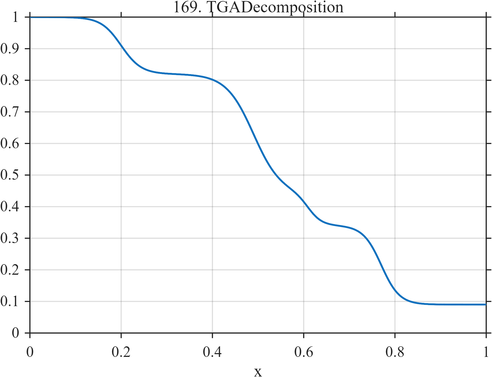

# TF169 — TGA Decomposition

## Overview

This thermogravimetric-analysis surrogate contains four overlapping mass-loss stages with different locations, widths, and magnitudes. The result is a monotone staircase whose weak intermediate stage can be hidden by aggressive smoothing.

## Mathematical Definition

Define

$$
L(x;c,w)=\frac{1}{1+e^{-(x-c)/w}}.
$$

Then

$$
\begin{aligned}
f(x)=1
&-0.18L(x;0.20,0.022)
-0.38L(x;0.49,0.030)\\
&-0.10L(x;0.61,0.015)
-0.25L(x;0.77,0.020).
\end{aligned}
$$

## Morphological Characteristics

| Property | Description |
|---|---|
| Primary family | Multistage monotone transition |
| Signal type | Sum of four smooth downward steps |
| Weak feature | $0.10$ mass-loss stage near $x=0.61$ |
| Regularity | Smooth with concentrated transition curvature |
| Main challenge | Resolve adjacent and unequal decomposition stages |

## Parameters

| Stage | Center | Width | Loss |
|---|---:|---:|---:|
| 1 | $0.20$ | $0.022$ | $0.18$ |
| 2 | $0.49$ | $0.030$ | $0.38$ |
| 3 | $0.61$ | $0.015$ | $0.10$ |
| 4 | $0.77$ | $0.020$ | $0.25$ |

## MATLAB Implementation

~~~matlab
N = 1024;
x = linspace(0,1,N);
S = @(z,c,w) 1./(1+exp(-(z-c)/w));
f = 1 ...
    - 0.18*S(x,0.20,0.022) ...
    - 0.38*S(x,0.49,0.030) ...
    - 0.10*S(x,0.61,0.015) ...
    - 0.25*S(x,0.77,0.020);

plot(x,f,'LineWidth',1.5); grid on
xlabel('x'); ylabel('f(x)'); title('TF169 — TGA Decomposition')
~~~

## Python Implementation

~~~python
import numpy as np
import matplotlib.pyplot as plt

N = 1024
x = np.linspace(0.0, 1.0, N)
S = lambda z, c, w: 1.0 / (1.0 + np.exp(-(z - c) / w))
f = 1.0
f = f - 0.18 * S(x, 0.20, 0.022)
f = f - 0.38 * S(x, 0.49, 0.030)
f = f - 0.10 * S(x, 0.61, 0.015)
f = f - 0.25 * S(x, 0.77, 0.020)

plt.plot(x, f)
plt.xlabel("x"); plt.ylabel("f(x)"); plt.title("TF169 — TGA Decomposition")
plt.grid(True); plt.show()
~~~

## Recommended Uses

- Multistage change recovery
- Monotone smoothing evaluation
- Weak transition preservation

## Provenance

This deterministic function is inspired by qualitative TGA mass-loss curves and is not material-specific.

[← Previous: DSC Phase Transitions](TF168_DSCPhaseTransitions.md) · [Category 9 catalog](index.md) · [Next: Van der Pol Relaxation →](TF170_VanDerPolRelaxation.md)
