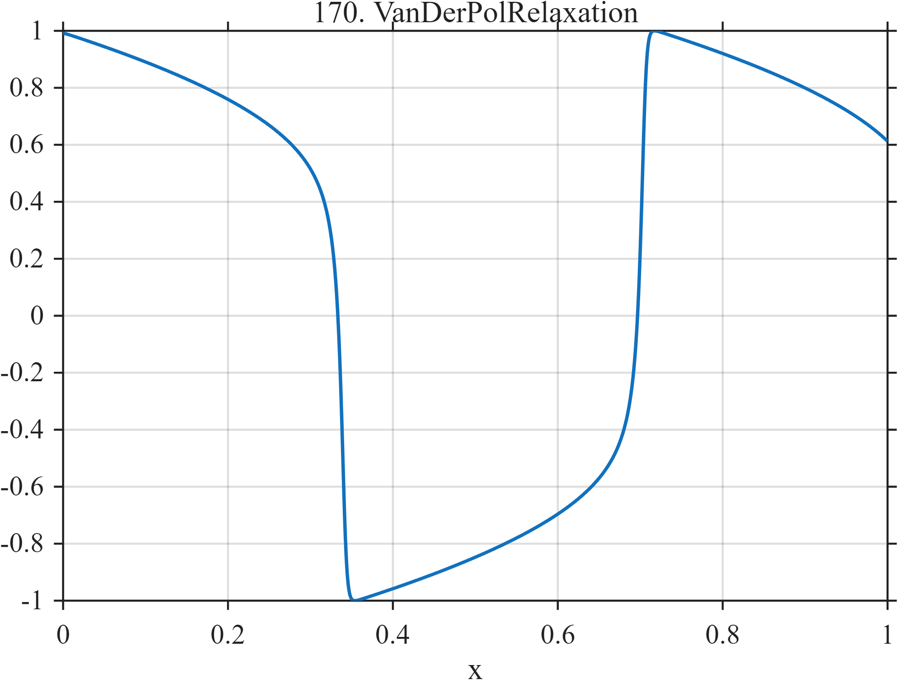

# TF170 — Van der Pol Relaxation

## Overview

This signal is a normalized numerical trajectory of the Van der Pol oscillator in its relaxation regime. Long, slowly varying portions alternate with rapid transitions, producing a deterministic waveform with strongly unequal local time scales.

## Mathematical Definition

The state $(y_1,y_2)$ satisfies

$$
\frac{dy_1}{dt}=y_2,
\qquad
\frac{dy_2}{dt}=\mu(1-y_1^2)y_2-y_1,
\qquad \mu=7,
$$

with $y_1(0)=2$ and $y_2(0)=0$. The system is integrated over $0\le t\le20$ using $N=1024$ equally spaced samples and fourth-order Runge–Kutta steps. The test signal is

$$
f_i=\frac{y_1(t_i)}{\max_j|y_1(t_j)|}.
$$

## Morphological Characteristics

| Property | Description |
|---|---|
| Primary family | Nonlinear relaxation oscillation |
| Signal type | Numerically integrated ODE trajectory |
| Time scales | Slow branches and fast transitions |
| Range | Normalized to maximum absolute value $1$ |
| Main challenge | Avoid blurring rapid transitions or roughening slow branches |

## Parameters

| Parameter | Value | Meaning |
|---|---:|---|
| $\mu$ | $7$ | Nonlinearity/relaxation strength |
| Integration interval | $[0,20]$ | Native ODE time |
| $N$ | $1024$ | Number of samples |
| Initial state | $(2,0)$ | Starting condition |

## MATLAB Implementation

~~~matlab
N = 1024;
x = linspace(0,1,N);
mu = 7.0;
dt = 20/(N-1);
y1 = zeros(1,N); y2 = zeros(1,N);
y1(1) = 2; y2(1) = 0;
rhs = @(a,b) [b; mu*(1-a.^2).*b-a];
for k = 1:N-1
    yy = [y1(k); y2(k)];
    k1 = rhs(yy(1),yy(2));
    q = yy + 0.5*dt*k1;
    k2 = rhs(q(1),q(2));
    q = yy + 0.5*dt*k2;
    k3 = rhs(q(1),q(2));
    q = yy + dt*k3;
    k4 = rhs(q(1),q(2));
    yn = yy + dt*(k1+2*k2+2*k3+k4)/6;
    y1(k+1) = yn(1); y2(k+1) = yn(2);
end
f = y1/max(abs(y1));

plot(x,f,'LineWidth',1.5); grid on
xlabel('x'); ylabel('f(x)'); title('TF170 — Van der Pol Relaxation')
~~~

## Python Implementation

~~~python
import numpy as np
import matplotlib.pyplot as plt

N = 1024
x = np.linspace(0.0, 1.0, N)
mu = 7.0
dt = 20.0 / (N - 1)
y = np.zeros((N, 2))
y[0] = [2.0, 0.0]

def rhs(state):
    y1, y2 = state
    return np.array([y2, mu * (1.0 - y1**2) * y2 - y1])

for k in range(N - 1):
    k1 = rhs(y[k])
    k2 = rhs(y[k] + 0.5 * dt * k1)
    k3 = rhs(y[k] + 0.5 * dt * k2)
    k4 = rhs(y[k] + dt * k3)
    y[k + 1] = y[k] + dt * (k1 + 2*k2 + 2*k3 + k4) / 6.0
f = y[:, 0] / np.max(np.abs(y[:, 0]))

plt.plot(x, f)
plt.xlabel("x"); plt.ylabel("f(x)"); plt.title("TF170 — Van der Pol Relaxation")
plt.grid(True); plt.show()
~~~

## Recommended Uses

- Strongly nonuniform smoothness tests
- Nonlinear oscillation denoising
- Transition-location and phase preservation

## Provenance

This function is generated from the standard Van der Pol system using the stated numerical convention; it is deterministic for the given parameters.

[← Previous: TGA Decomposition](TF169_TGADecomposition.md) · [Category 9 catalog](index.md) · [Next: Seismic Dispersive Wave →](TF171_SeismicDispersiveWave.md)
