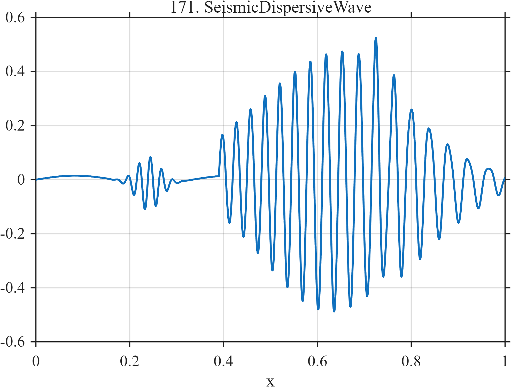

# TF171 — Seismic Dispersive Wave

## Overview

This seismological surrogate combines a quiet low-frequency baseline, a small early arrival, a broad dispersive wave packet, and a weak late coda. Its physically meaningful components differ substantially in amplitude, duration, and instantaneous frequency.

## Mathematical Definition

Let $u_a(x)=(x-a)_+$ and $I_a(x)=1$ when $x\ge a$ and $0$ otherwise. Then

$$
\begin{aligned}
f(x)={}&0.015\sin(6\pi x)
+0.10e^{-\frac12((x-0.24)/0.025)^2}\sin(84\pi x)\\
&+0.48I_{0.39}(x)e^{-\frac12((x-0.64)/0.16)^2}
\sin\{2\pi[34u_{0.39}(x)-10u_{0.39}(x)^2]\}\\
&+0.10I_{0.72}(x)e^{-9u_{0.72}(x)}\sin\{96\pi u_{0.72}(x)\}.
\end{aligned}
$$

## Morphological Characteristics

| Property | Description |
|---|---|
| Primary family | Localized dispersive oscillation |
| Components | Baseline, early packet, main packet, coda |
| Frequency behavior | Decreasing frequency in the main packet |
| Amplitude hierarchy | Strong main arrival with weak precursor and coda |
| Main challenge | Preserve dispersion and low-amplitude arrivals |

## Parameters

| Feature | Location/onset | Scale |
|---|---:|---|
| Early arrival | $0.24$ | Gaussian width $0.025$ |
| Main packet | $0.39$ onward | Envelope centered at $0.64$ |
| Coda | $0.72$ onward | Decay rate $9$ |

## MATLAB Implementation

~~~matlab
N = 1024;
x = linspace(0,1,N);
f = 0.015*sin(2*pi*3*x) + ...
    0.10*exp(-0.5*((x-0.24)/0.025).^2).*sin(2*pi*42*x);
u = max(x-0.39,0);
env = (x>=0.39).*exp(-0.5*((x-0.64)/0.16).^2);
f = f + 0.48*env.*sin(2*pi*(34*u-10*u.^2));
uCoda = max(x-0.72,0);
f = f + (x>=0.72).*0.10.*exp(-9*uCoda).*sin(2*pi*48*uCoda);

plot(x,f,'LineWidth',1.2); grid on
xlabel('x'); ylabel('f(x)'); title('TF171 — Seismic Dispersive Wave')
~~~

## Python Implementation

~~~python
import numpy as np
import matplotlib.pyplot as plt

N = 1024
x = np.linspace(0.0, 1.0, N)
f = 0.015 * np.sin(2*np.pi*3*x)
f += 0.10 * np.exp(-0.5*((x-0.24)/0.025)**2) * np.sin(2*np.pi*42*x)
u = np.maximum(x-0.39, 0.0)
env = (x >= 0.39) * np.exp(-0.5*((x-0.64)/0.16)**2)
f += 0.48 * env * np.sin(2*np.pi*(34*u-10*u**2))
u_coda = np.maximum(x-0.72, 0.0)
f += (x >= 0.72) * 0.10 * np.exp(-9*u_coda) * np.sin(2*np.pi*48*u_coda)

plt.plot(x, f)
plt.xlabel("x"); plt.ylabel("f(x)"); plt.title("TF171 — Seismic Dispersive Wave")
plt.grid(True); plt.show()
~~~

## Recommended Uses

- Dispersive packet denoising
- Arrival-time and phase preservation
- Weak-coda recovery

## Provenance

This deterministic signal is inspired by qualitative seismic arrivals and dispersion. It is not a propagation simulation or recorded seismogram.

[← Previous: Van der Pol Relaxation](TF170_VanDerPolRelaxation.md) · [Category 9 catalog](index.md) · [Next: Tertiary Creep Failure →](TF172_TertiaryCreepFailure.md)
