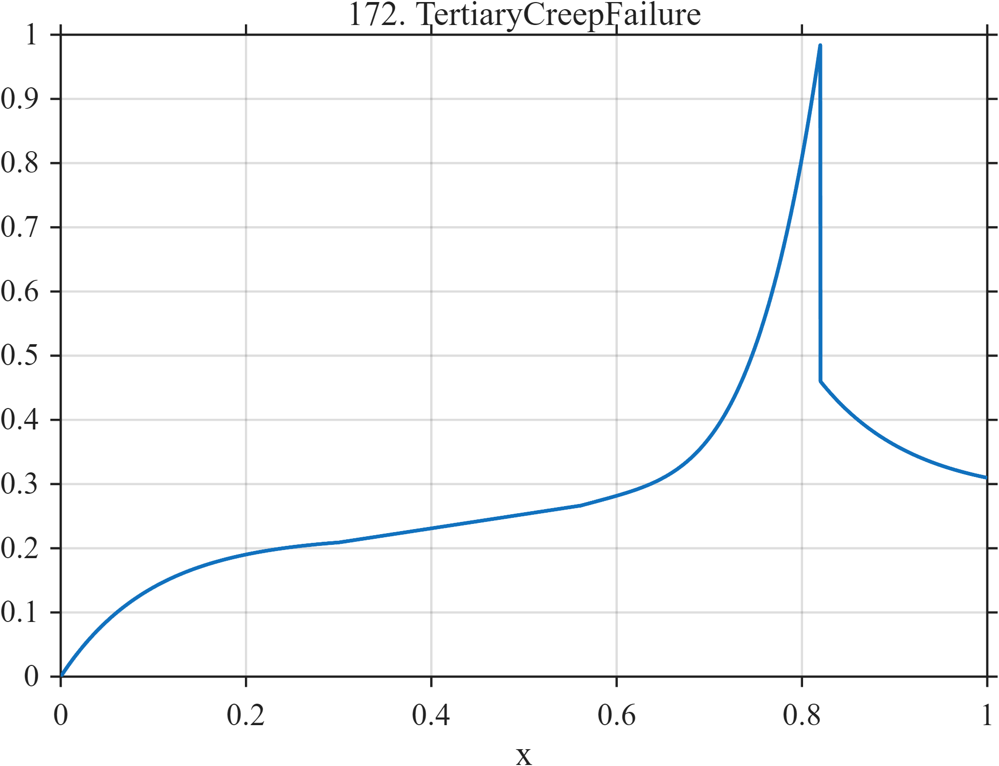

# TF172 — Tertiary Creep Failure

## Overview

This creep surrogate contains primary deceleration, approximately steady secondary creep, rapidly accelerating tertiary creep, and a sudden failure drop. The onset of acceleration is gradual, whereas failure is abrupt.

## Mathematical Definition

For $0\le x\le1$,

$$
f(x)=
\begin{cases}
0.22(1-e^{-10x}), & x<0.30,\\
0.209+0.22(x-0.30), & 0.30\le x<0.56,\\
0.266+0.10u+0.62u^4,\quad u=\dfrac{x-0.56}{0.82-0.56}, & 0.56\le x<0.82,\\
0.28+0.18e^{-10(x-0.82)}, & x\ge0.82.
\end{cases}
$$

## Morphological Characteristics

| Property | Description |
|---|---|
| Primary family | Accelerating trend with failure |
| Regimes | Primary, secondary, tertiary, post-failure |
| Curvature | Strongly increasing before $x=0.82$ |
| Discontinuity | Large failure drop at $x=0.82$ |
| Main challenge | Preserve early acceleration and terminal failure |

## Parameters

| Boundary | $0.30$ | $0.56$ | $0.82$ |
|---|---:|---:|---:|
| Interpretation | Secondary onset | Tertiary onset | Failure |

## MATLAB Implementation

~~~matlab
N = 1024;
x = linspace(0,1,N);
f = zeros(size(x));
m1 = x < 0.30;
m2 = x >= 0.30 & x < 0.56;
m3 = x >= 0.56 & x < 0.82;
m4 = x >= 0.82;
f(m1) = 0.22*(1-exp(-10*x(m1)));
f(m2) = 0.209 + 0.22*(x(m2)-0.30);
u = (x(m3)-0.56)/(0.82-0.56);
f(m3) = 0.266 + 0.10*u + 0.62*u.^4;
f(m4) = 0.28 + 0.18*exp(-10*(x(m4)-0.82));

plot(x,f,'LineWidth',1.5); grid on
xlabel('x'); ylabel('f(x)'); title('TF172 — Tertiary Creep Failure')
~~~

## Python Implementation

~~~python
import numpy as np
import matplotlib.pyplot as plt

N = 1024
x = np.linspace(0.0, 1.0, N)
f = np.zeros_like(x)
m1 = x < 0.30
m2 = (x >= 0.30) & (x < 0.56)
m3 = (x >= 0.56) & (x < 0.82)
m4 = x >= 0.82
f[m1] = 0.22 * (1.0 - np.exp(-10.0*x[m1]))
f[m2] = 0.209 + 0.22 * (x[m2]-0.30)
u = (x[m3]-0.56)/(0.82-0.56)
f[m3] = 0.266 + 0.10*u + 0.62*u**4
f[m4] = 0.28 + 0.18*np.exp(-10.0*(x[m4]-0.82))

plt.plot(x, f)
plt.xlabel("x"); plt.ylabel("f(x)"); plt.title("TF172 — Tertiary Creep Failure")
plt.grid(True); plt.show()
~~~

## Recommended Uses

- Failure-precursor preservation
- Accelerating-trend denoising
- Mixed smooth-change and jump recovery

## Provenance

This deterministic function is inspired by qualitative creep curves and is not a calibrated lifetime model.

[← Previous: Seismic Dispersive Wave](TF171_SeismicDispersiveWave.md) · [Category 9 catalog](index.md) · [Next: Transformer Inrush →](TF173_TransformerInrush.md)
