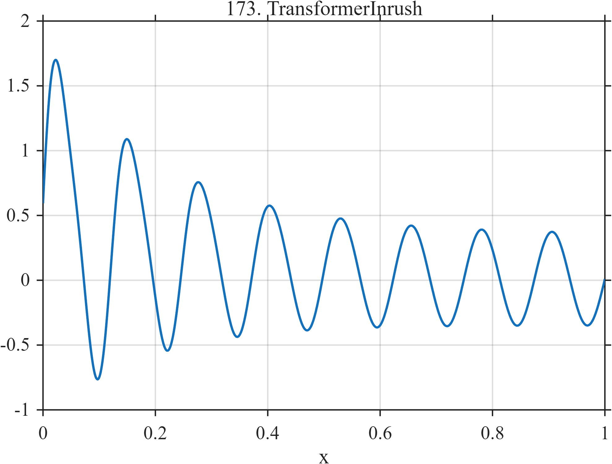

# TF173 — Transformer Inrush

## Overview

This transformer-inrush surrogate combines a decaying asymmetric offset, a fundamental oscillation with a large transient envelope, and a decaying second harmonic. The initial cycles are strongly nonstationary before settling toward a persistent sinusoid.

## Mathematical Definition

For $0\le x\le1$,

$$
\begin{aligned}
f(x)={}&(0.35+1.05e^{-5x})\sin(16\pi x)
+0.48e^{-4x}\\
&+0.26e^{-5.5x}\sin(32\pi x+0.45).
\end{aligned}
$$

## Morphological Characteristics

| Property | Description |
|---|---|
| Primary family | Decaying nonstationary oscillation |
| Persistent component | Fundamental sinusoid of amplitude $0.35$ |
| Transients | Decaying envelope, DC offset, and second harmonic |
| Asymmetry | Strongest near the left boundary |
| Main challenge | Preserve early-cycle distortion and steady oscillation |

## Parameters

| Component | Initial amplitude | Decay rate |
|---|---:|---:|
| Fundamental transient envelope | $1.05$ | $5$ |
| Offset | $0.48$ | $4$ |
| Second harmonic | $0.26$ | $5.5$ |

## MATLAB Implementation

~~~matlab
N = 1024;
x = linspace(0,1,N);
f = (0.35 + 1.05*exp(-5*x)).*sin(2*pi*8*x) ...
    + 0.48*exp(-4*x) ...
    + 0.26*exp(-5.5*x).*sin(2*pi*16*x+0.45);

plot(x,f,'LineWidth',1.2); grid on
xlabel('x'); ylabel('f(x)'); title('TF173 — Transformer Inrush')
~~~

## Python Implementation

~~~python
import numpy as np
import matplotlib.pyplot as plt

N = 1024
x = np.linspace(0.0, 1.0, N)
f = (0.35 + 1.05*np.exp(-5*x))*np.sin(2*np.pi*8*x)
f += 0.48*np.exp(-4*x)
f += 0.26*np.exp(-5.5*x)*np.sin(2*np.pi*16*x+0.45)

plt.plot(x, f)
plt.xlabel("x"); plt.ylabel("f(x)"); plt.title("TF173 — Transformer Inrush")
plt.grid(True); plt.show()
~~~

## Recommended Uses

- Transient harmonic denoising
- Boundary-localized nonstationarity
- Amplitude and phase preservation

## Provenance

This deterministic waveform is inspired by transformer magnetizing inrush. It is not a circuit or magnetic-core simulation.

[← Previous: Tertiary Creep Failure](TF172_TertiaryCreepFailure.md) · [Category 9 catalog](index.md) · [Next: MEMS Pull-In / Release →](TF174_MEMSPullInRelease.md)
