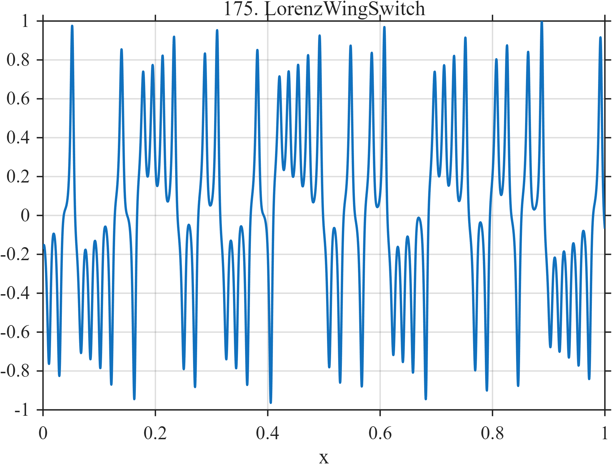

# TF175 — Lorenz Wing Switch

## Overview

This signal is the normalized first coordinate of a numerically integrated Lorenz trajectory after a burn-in period. Oscillations within each attractor wing are interrupted by irregular sign-changing wing switches, producing deterministic chaotic multiscale structure.

## Mathematical Definition

The Lorenz system is

$$
\dot X=\sigma(Y-X),\qquad
\dot Y=X(\rho-Z)-Y,\qquad
\dot Z=XY-\beta Z,
$$

with

$$
(\sigma,\rho,\beta)=\left(10,28,\frac83\right),
\qquad (X_0,Y_0,Z_0)=(1,1,1).
$$

Fourth-order Runge–Kutta integration uses step $0.01$. After discarding $1200$ burn-in samples, retain $N=1024$ values $X_i$, center them, and normalize:

$$
f_i=\frac{X_i-\bar X}{\max_j|X_j-\bar X|}.
$$

## Morphological Characteristics

| Property | Description |
|---|---|
| Primary family | Deterministic chaotic oscillation |
| Local structure | Smooth within-wing rotations |
| Regime changes | Irregular sign-changing wing switches |
| Range | Centered and normalized to maximum absolute value $1$ |
| Main challenge | Preserve nonperiodic structure without treating it as noise |

## Parameters

| Parameter | Value |
|---|---:|
| $\sigma$ | $10$ |
| $\rho$ | $28$ |
| $\beta$ | $8/3$ |
| RK4 step | $0.01$ |
| Burn-in | $1200$ samples |
| Retained length | $1024$ samples |

## MATLAB Implementation

~~~matlab
N = 1024;
x = linspace(0,1,N);
sigma = 10; rho = 28; beta = 8/3;
dt = 0.01; burn = 1200; total = N + burn;
Y = zeros(3,total); Y(:,1) = [1;1;1];
rhs = @(v) [sigma*(v(2)-v(1)); ...
             v(1)*(rho-v(3))-v(2); ...
             v(1)*v(2)-beta*v(3)];
for k = 1:total-1
    yy = Y(:,k);
    k1 = rhs(yy);
    k2 = rhs(yy+0.5*dt*k1);
    k3 = rhs(yy+0.5*dt*k2);
    k4 = rhs(yy+dt*k3);
    Y(:,k+1) = yy + dt*(k1+2*k2+2*k3+k4)/6;
end
f = Y(1,burn+1:end);
f = f - mean(f);
f = f/max(abs(f));

plot(x,f,'LineWidth',1.2); grid on
xlabel('x'); ylabel('f(x)'); title('TF175 — Lorenz Wing Switch')
~~~

## Python Implementation

~~~python
import numpy as np
import matplotlib.pyplot as plt

N = 1024
x = np.linspace(0.0, 1.0, N)
sigma, rho, beta = 10.0, 28.0, 8.0/3.0
dt, burn = 0.01, 1200
y = np.zeros((N + burn, 3))
y[0] = [1.0, 1.0, 1.0]

def rhs(v):
    X, Y, Z = v
    return np.array([sigma*(Y-X), X*(rho-Z)-Y, X*Y-beta*Z])

for k in range(len(y)-1):
    k1 = rhs(y[k])
    k2 = rhs(y[k] + 0.5*dt*k1)
    k3 = rhs(y[k] + 0.5*dt*k2)
    k4 = rhs(y[k] + dt*k3)
    y[k+1] = y[k] + dt*(k1+2*k2+2*k3+k4)/6.0
f = y[burn:, 0]
f -= np.mean(f)
f /= np.max(np.abs(f))

plt.plot(x, f)
plt.xlabel("x"); plt.ylabel("f(x)"); plt.title("TF175 — Lorenz Wing Switch")
plt.grid(True); plt.show()
~~~

## Recommended Uses

- Denoising deterministic chaotic signals
- Regime-switch preservation
- Testing methods under broadband nonperiodic structure

## Provenance

This signal is generated from the standard Lorenz system using the stated deterministic initial condition and numerical convention.

[← Previous: MEMS Pull-In / Release](TF174_MEMSPullInRelease.md) · [Category 9 catalog](index.md) · [Next: Dyadic Phase Twins →](TF176_DyadicPhaseTwins.md)
