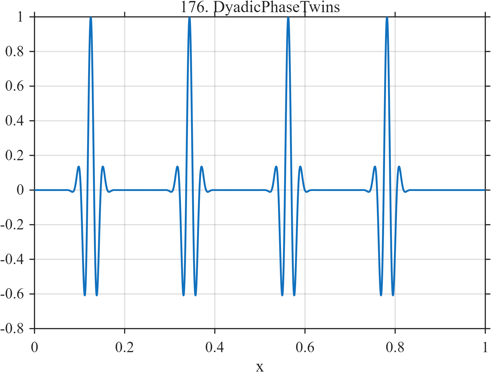

# TF176 — Dyadic Phase Twins

## Overview

Four identical Gaussian-windowed cosine packets are placed at deliberately selected sample indices. Because the local shapes are exact translations, differences in denoising quality reveal sensitivity to dyadic alignment, decimation phase, or location-dependent processing rather than to morphology.

## Mathematical Definition

This diagnostic uses $N=4096$ samples

$$
x_i=\frac{i-1}{N-1},\qquad i=1,\ldots,N,
$$

and one-based center indices

$$
j=(512,1409,2306,3203),
\qquad c_k=\frac{j_k-1}{N-1}.
$$

The signal is

$$
f(x)=\sum_{k=1}^{4}
\exp\left[-\frac12\left(\frac{x-c_k}{0.014}\right)^2\right]
\cos\{2\pi34(x-c_k)\}.
$$

## Morphological Characteristics

| Property | Description |
|---|---|
| Primary family | Controlled translation diagnostic |
| Signal type | Four identical localized wave packets |
| Controlled variable | Sample-grid and dyadic alignment |
| Native sampling | $N=4096$ |
| Main challenge | Produce translation-consistent estimates |

## Parameters

| Parameter | Value | Meaning |
|---|---|---|
| Center indices | $512,1409,2306,3203$ | One-based MATLAB indices |
| Envelope width | $0.014$ | Gaussian localization scale |
| Carrier frequency | $34$ | Cycles per unit interval |
| $N$ | $4096$ | Required native sample count |

## MATLAB Implementation

~~~matlab
N = 4096;
x = linspace(0,1,N);
f = zeros(size(x));
idx = [512 1409 2306 3203];
centers = (idx-1)/(N-1);
for k = 1:numel(centers)
    u = x-centers(k);
    f = f + exp(-0.5*(u/0.014).^2).*cos(2*pi*34*u);
end

plot(x,f,'LineWidth',1.2); grid on
xlabel('x'); ylabel('f(x)'); title('TF176 — Dyadic Phase Twins')
~~~

## Python Implementation

~~~python
import numpy as np
import matplotlib.pyplot as plt

N = 4096
x = np.linspace(0.0, 1.0, N)
indices = np.array([512, 1409, 2306, 3203])  # one-based indices
centers = (indices - 1) / (N - 1)
f = np.zeros_like(x)
for center in centers:
    u = x-center
    f += np.exp(-0.5*(u/0.014)**2)*np.cos(2*np.pi*34*u)

plt.plot(x, f)
plt.xlabel("x"); plt.ylabel("f(x)"); plt.title("TF176 — Dyadic Phase Twins")
plt.grid(True); plt.show()
~~~

## Recommended Uses

- Translation-invariance diagnostics
- Dyadic phase and decimation sensitivity
- Comparing cycle-spinning or undecimated procedures

## Provenance

This is a deliberately artificial controlled diagnostic. Its sample count and center indices are part of the definition and should not be changed when testing dyadic alignment.

[← Previous: Lorenz Wing Switch](TF175_LorenzWingSwitch.md) · [Category 9 catalog](index.md) · [Next: Boundary / Interior Twins →](TF177_BoundaryInteriorTwins.md)
