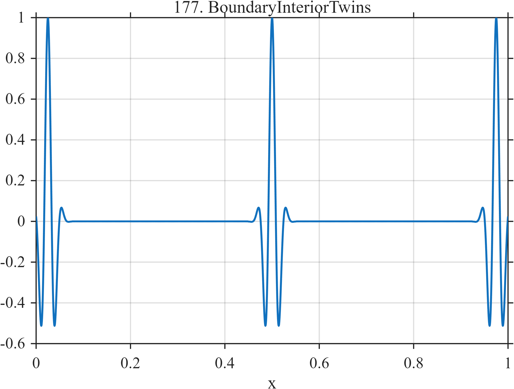

# TF177 — Boundary / Interior Twins

## Overview

Three identical wave packets are centered near the left boundary, in the interior, and near the right boundary. Any systematic difference among their estimates exposes boundary-extension artifacts or location-dependent smoothing.

## Mathematical Definition

With centers

$$
c=(0.025,0.500,0.975),
$$

the signal is

$$
f(x)=\sum_{k=1}^{3}
\exp\left[-\frac12\left(\frac{x-c_k}{0.013}\right)^2\right]
\cos\{2\pi31(x-c_k)\},
\qquad 0\le x\le1.
$$

## Morphological Characteristics

| Property | Description |
|---|---|
| Primary family | Controlled boundary diagnostic |
| Signal type | Three identical localized wave packets |
| Controlled variable | Distance from the domain boundary |
| Symmetry | Left, center, and right placements |
| Main challenge | Treat boundary and interior features consistently |

## Parameters

| Parameter | Value |
|---|---|
| Centers | $0.025,0.500,0.975$ |
| Envelope width | $0.013$ |
| Carrier frequency | $31$ cycles/unit |

## MATLAB Implementation

~~~matlab
N = 1024;
x = linspace(0,1,N);
f = zeros(size(x));
for c = [0.025 0.50 0.975]
    u = x-c;
    f = f + exp(-0.5*(u/0.013).^2).*cos(2*pi*31*u);
end

plot(x,f,'LineWidth',1.2); grid on
xlabel('x'); ylabel('f(x)'); title('TF177 — Boundary / Interior Twins')
~~~

## Python Implementation

~~~python
import numpy as np
import matplotlib.pyplot as plt

N = 1024
x = np.linspace(0.0, 1.0, N)
f = np.zeros_like(x)
for center in [0.025, 0.500, 0.975]:
    u = x-center
    f += np.exp(-0.5*(u/0.013)**2)*np.cos(2*np.pi*31*u)

plt.plot(x, f)
plt.xlabel("x"); plt.ylabel("f(x)"); plt.title("TF177 — Boundary / Interior Twins")
plt.grid(True); plt.show()
~~~

## Recommended Uses

- Boundary-extension assessment
- Location-invariance checks
- Comparing periodic, symmetric, and zero-padding conventions

## Provenance

This is an artificial controlled diagnostic designed specifically to reveal boundary-handling effects.

[← Previous: Dyadic Phase Twins](TF176_DyadicPhaseTwins.md) · [Category 9 catalog](index.md) · [Next: Rayleigh Doublet Ladder →](TF178_RayleighDoubletLadder.md)
