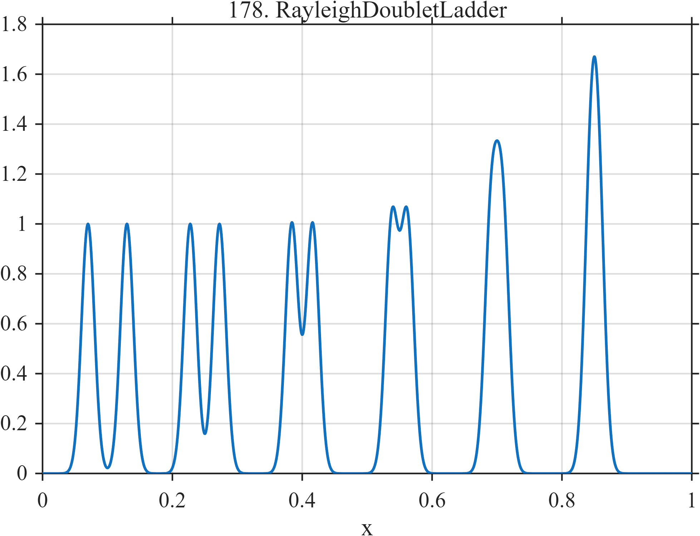

# TF178 — Rayleigh Doublet Ladder

## Overview

Six equal-width Gaussian doublets have progressively smaller separations. The sequence passes from clearly resolved pairs to nearly merged peaks, creating a direct resolution diagnostic for smoothing and denoising methods.

## Mathematical Definition

Let

$$
c=(0.10,0.25,0.40,0.55,0.70,0.85),
$$

$$
d=(0.060,0.045,0.032,0.024,0.018,0.012),
\qquad w=0.010.
$$

Then

$$
f(x)=\sum_{k=1}^{6}\left[
e^{-\frac12((x-c_k+d_k/2)/w)^2}
+e^{-\frac12((x-c_k-d_k/2)/w)^2}
\right].
$$

## Morphological Characteristics

| Property | Description |
|---|---|
| Primary family | Controlled resolution ladder |
| Signal type | Six Gaussian doublets |
| Controlled variable | Within-pair separation |
| Constant property | Peak width $w=0.010$ |
| Main challenge | Resolve close pairs without creating false splitting |

## Parameters

| Pair center | Separation |
|---:|---:|
| $0.10$ | $0.060$ |
| $0.25$ | $0.045$ |
| $0.40$ | $0.032$ |
| $0.55$ | $0.024$ |
| $0.70$ | $0.018$ |
| $0.85$ | $0.012$ |

## MATLAB Implementation

~~~matlab
N = 1024;
x = linspace(0,1,N);
f = zeros(size(x));
centers = [0.10 0.25 0.40 0.55 0.70 0.85];
separation = [0.060 0.045 0.032 0.024 0.018 0.012];
w = 0.010;
for k = 1:numel(centers)
    f = f + exp(-0.5*((x-(centers(k)-separation(k)/2))/w).^2) ...
          + exp(-0.5*((x-(centers(k)+separation(k)/2))/w).^2);
end

plot(x,f,'LineWidth',1.2); grid on
xlabel('x'); ylabel('f(x)'); title('TF178 — Rayleigh Doublet Ladder')
~~~

## Python Implementation

~~~python
import numpy as np
import matplotlib.pyplot as plt

N = 1024
x = np.linspace(0.0, 1.0, N)
centers = np.array([0.10, 0.25, 0.40, 0.55, 0.70, 0.85])
separation = np.array([0.060, 0.045, 0.032, 0.024, 0.018, 0.012])
w = 0.010
f = np.zeros_like(x)
for center, distance in zip(centers, separation):
    f += np.exp(-0.5*((x-(center-distance/2))/w)**2)
    f += np.exp(-0.5*((x-(center+distance/2))/w)**2)

plt.plot(x, f)
plt.xlabel("x"); plt.ylabel("f(x)"); plt.title("TF178 — Rayleigh Doublet Ladder")
plt.grid(True); plt.show()
~~~

## Recommended Uses

- Empirical peak-resolution limits
- Bandwidth and threshold selection studies
- Detecting artificial peak merging or splitting

## Provenance

This is an artificial diagnostic named for the general idea of a resolution ladder; it does not impose a particular optical Rayleigh criterion.

[← Previous: Boundary / Interior Twins](TF177_BoundaryInteriorTwins.md) · [Category 9 catalog](index.md) · [Next: Equal-Energy Scale Ladder →](TF179_EqualEnergyScaleLadder.md)
