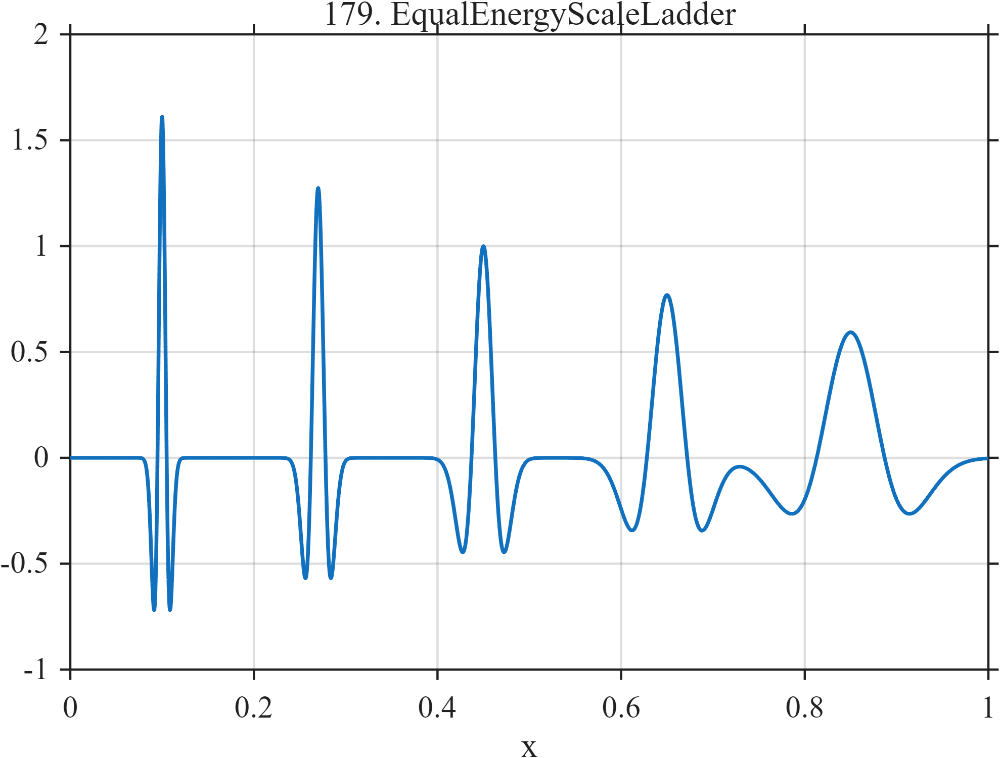

# TF179 — Equal-Energy Scale Ladder

## Overview

Five Mexican-hat-like features span a wide range of widths. Their amplitudes are scaled inversely with the square root of width so that the features have comparable continuous-domain energy. This isolates scale preference from raw-energy preference.

## Mathematical Definition

Let

$$
c=(0.10,0.27,0.45,0.65,0.85),
\qquad
w=(0.005,0.008,0.013,0.022,0.037),
$$

and $w_0=0.013$. Define

$$
z_k(x)=\frac{x-c_k}{w_k},
\qquad
A_k=\sqrt{\frac{w_0}{w_k}}.
$$

The signal is

$$
f(x)=\sum_{k=1}^{5}A_k[1-z_k(x)^2]e^{-z_k(x)^2/2}.
$$

## Morphological Characteristics

| Property | Description |
|---|---|
| Primary family | Controlled scale-bias diagnostic |
| Signal type | Five second-derivative Gaussian profiles |
| Controlled variable | Width from $0.005$ to $0.037$ |
| Equalized property | Approximate continuous-domain energy |
| Main challenge | Treat narrow and broad equal-energy features fairly |

## Parameters

| Center | Width | Amplitude factor $\sqrt{0.013/w}$ |
|---:|---:|---:|
| $0.10$ | $0.005$ | $1.612$ |
| $0.27$ | $0.008$ | $1.275$ |
| $0.45$ | $0.013$ | $1.000$ |
| $0.65$ | $0.022$ | $0.769$ |
| $0.85$ | $0.037$ | $0.593$ |

## MATLAB Implementation

~~~matlab
N = 1024;
x = linspace(0,1,N);
f = zeros(size(x));
centers = [0.10 0.27 0.45 0.65 0.85];
widths = [0.005 0.008 0.013 0.022 0.037];
wref = 0.013;
for k = 1:numel(centers)
    z = (x-centers(k))/widths(k);
    A = sqrt(wref/widths(k));
    f = f + A*(1-z.^2).*exp(-0.5*z.^2);
end

plot(x,f,'LineWidth',1.2); grid on
xlabel('x'); ylabel('f(x)'); title('TF179 — Equal-Energy Scale Ladder')
~~~

## Python Implementation

~~~python
import numpy as np
import matplotlib.pyplot as plt

N = 1024
x = np.linspace(0.0, 1.0, N)
centers = np.array([0.10, 0.27, 0.45, 0.65, 0.85])
widths = np.array([0.005, 0.008, 0.013, 0.022, 0.037])
wref = 0.013
f = np.zeros_like(x)
for center, width in zip(centers, widths):
    z = (x-center)/width
    amplitude = np.sqrt(wref/width)
    f += amplitude*(1-z**2)*np.exp(-0.5*z**2)

plt.plot(x, f)
plt.xlabel("x"); plt.ylabel("f(x)"); plt.title("TF179 — Equal-Energy Scale Ladder")
plt.grid(True); plt.show()
~~~

## Recommended Uses

- Scale-bias measurement
- Comparing multiscale shrinkage rules
- Equal-energy feature retention

## Provenance

This is a deliberately artificial scale diagnostic. The amplitude normalization is part of the definition.

[← Previous: Rayleigh Doublet Ladder](TF178_RayleighDoubletLadder.md) · [Category 9 catalog](index.md) · [Next: Hölder Ladder →](TF180_HolderLadder.md)
