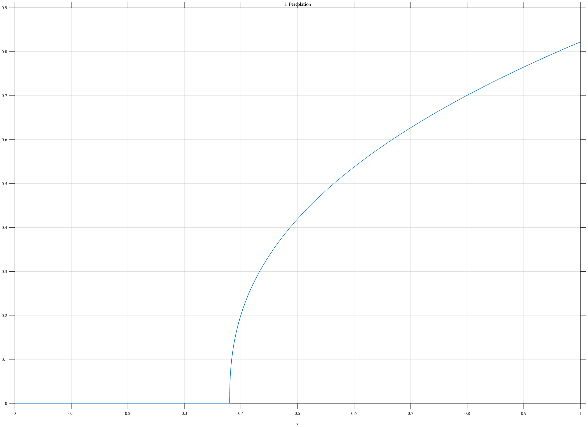

# Signal Catalog

The signals are organized according to their primary morphological
characteristics. Select a signal to view its definition, parameters,
implementation, and references.

## Available Signals

### 1. Percolation

A smooth and slowly varying test signal.

[View Percolation →](../signals/signal-01/)

---

### 2. Signal 2

An oscillatory signal with constant frequency.

[View Planck→](../signals/plnk/)

---

### 3. Signal 3

A chirp signal with time-varying frequency.

[View Signal 3 →]({{ "/signals/signal-03/" | relative_url }})

---

Continue the same structure through Signal 10.

[Return to Home →]({{ "/" | relative_url }})
