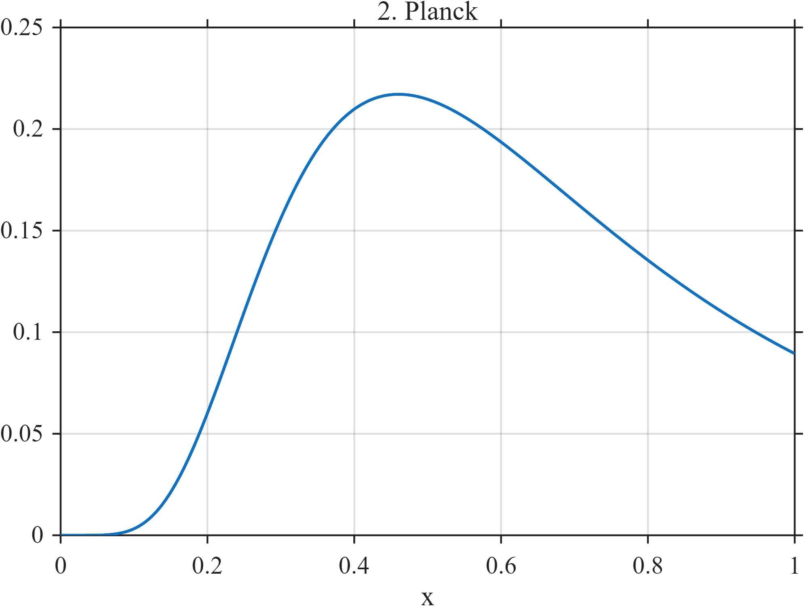

---
layout: default
title: Planck
---

# Planck



## Overview

The **Planck** signal is a dimensionless representation of a black-body
radiation spectrum. It is smooth over its entire domain but has a strongly
asymmetric morphology. The signal exhibits a steep initial rise, reaches one
spectral maximum, and then decreases gradually along a relatively long tail.

This signal tests whether a denoising method can preserve rapidly changing
curvature, the location and height of a smooth peak, and asymmetric tail
behavior without introducing artificial discontinuities or oscillations.

The signal is a dimensionless benchmark morphology and should not be
interpreted as a physically calibrated black-body radiation spectrum.

## Mathematical Definition

For $0\leq x\leq1$, define the transformed spectral coordinate

```math
\lambda(x)=0.08+0.92x.
```

The Planck signal is defined by

```math
f(x)=
\frac{\lambda(x)^{-5}}
{\exp\left\{2.5/\lambda(x)\right\}-1}.
```

Equivalently,

```math
f(x)=
\frac{(0.08+0.92x)^{-5}}
{\exp\left\{2.5/(0.08+0.92x)\right\}-1}.
```

The transformation maps the normalized domain $0\leq x\leq1$ to

```math
0.08\leq\lambda(x)\leq1.
```

Because $\lambda(x)>0$ throughout the domain, the denominator remains
strictly positive. Therefore, $f(x)$ is continuous and infinitely
differentiable over the complete interval $[0,1]$.

The signal reaches its maximum approximately when

```math
\lambda(x)\approx0.5035,
```

which corresponds to

```math
x\approx
\frac{0.5035-0.08}{0.92}
\approx0.46.
```

Thus, the spectral maximum occurs before the midpoint of the domain,
producing the characteristic asymmetric shape and long right tail.

## Morphological Characteristics

| Property | Description |
|---|---|
| Signal family | Smooth, asymmetric, and peak-shaped signals |
| Signal type | Deterministic and nonstationary |
| Domain | $0\leq x\leq1$ |
| Transformed domain | $0.08\leq\lambda(x)\leq1$ |
| Continuity | Continuous everywhere |
| Differentiability | Infinitely differentiable on $[0,1]$ |
| Jump discontinuities | None |
| Oscillatory behavior | None |
| Number of principal peaks | One |
| Symmetry | Strongly asymmetric |
| Initial behavior | Steep continuous increase |
| Final behavior | Gradually decreasing tail |
| Main feature | Smooth spectral maximum |
| Primary challenge | Preserving strongly varying curvature and peak geometry |

## Parameters

A general parameterization of the Planck signal can be written as

```math
\lambda(x)=\lambda_{\min}+s x
```

and

```math
f(x)=
A\frac{\lambda(x)^{-5}}
{\exp\left\{c/\lambda(x)\right\}-1},
```

where:

- $A$ is an amplitude multiplier;
- $\lambda_{\min}$ is the minimum transformed spectral coordinate;
- $s$ controls the range of the transformed coordinate; and
- $c$ controls the location and shape of the spectral maximum.

The default parameters are:

| Parameter | Description | Default | Allowed values |
|---|---|---:|---|
| `n` | Number of sampled observations | 1024 | Integer $n\geq2$ |
| `lambda_min` | Minimum value of $\lambda(x)$ | 0.08 | Positive real number |
| `lambda_scale` | Increase in $\lambda(x)$ across the domain | 0.92 | Positive real number |
| `shape` | Exponential shape parameter | 2.5 | Positive real number |
| `amplitude` | Global amplitude multiplier | 1.0 | Positive real number |

For the default values,

```math
\lambda(x)=0.08+0.92x.
```

## MATLAB Implementation

```matlab
% Planck signal
clear;
close all;
clc;

% Signal parameters
n = 1024;
lambdaMin = 0.08;
lambdaScale = 0.92;
shape = 2.5;
amplitude = 1.0;

% Sampling locations
x = linspace(0, 1, n);

% Transformed spectral coordinate
lambda = lambdaMin + lambdaScale * x;

% Generate the Planck signal
% expm1(z) accurately evaluates exp(z)-1.
f = amplitude * lambda.^(-5) ./ expm1(shape ./ lambda);

% Locate the sampled spectral maximum
[maximumValue, maximumIndex] = max(f);
maximumLocation = x(maximumIndex);

% Plot the signal
figure('Color', 'w');

plot(x, f, 'b-', 'LineWidth', 1.8);
hold on;

plot( ...
    maximumLocation, ...
    maximumValue, ...
    'ro', ...
    'MarkerFaceColor', 'r', ...
    'MarkerSize', 6);

xline( ...
    maximumLocation, ...
    '--r', ...
    'Spectral maximum', ...
    'LineWidth', 1.1);

hold off;

xlabel('x');
ylabel('f(x)');
title('Planck Signal');
grid on;
box on;
xlim([0, 1]);

% Save the image for the GitHub documentation
exportgraphics( ...
    gcf, ...
    'planck.png', ...
    'Resolution', 300);
```

Upload the generated image to:

```text
docs/assets/images/planck.png
```

## Python Implementation

```python
import numpy as np
import matplotlib.pyplot as plt

# Signal parameters
n = 1024
lambda_min = 0.08
lambda_scale = 0.92
shape = 2.5
amplitude = 1.0

# Sampling locations
x = np.linspace(0, 1, n)

# Transformed spectral coordinate
wavelength = lambda_min + lambda_scale * x

# Generate the Planck signal
# np.expm1(z) accurately evaluates exp(z)-1.
f = (
    amplitude
    * wavelength ** (-5)
    / np.expm1(shape / wavelength)
)

# Locate the sampled spectral maximum
maximum_index = np.argmax(f)
maximum_location = x[maximum_index]
maximum_value = f[maximum_index]

# Plot the signal
plt.figure(figsize=(8, 4))

plt.plot(
    x,
    f,
    color="blue",
    linewidth=1.8,
    label="Planck signal"
)

plt.scatter(
    maximum_location,
    maximum_value,
    color="red",
    s=35,
    zorder=3,
    label="Spectral maximum"
)

plt.axvline(
    maximum_location,
    color="red",
    linestyle="--",
    linewidth=1.1,
    alpha=0.7
)

plt.xlabel("x")
plt.ylabel("f(x)")
plt.title("Planck Signal")
plt.xlim(0, 1)
plt.grid(True, alpha=0.3)
plt.legend()
plt.tight_layout()

# Save the image for the GitHub documentation
plt.savefig(
    "planck.png",
    dpi=300,
    bbox_inches="tight"
)

plt.show()
```

## Recommended Uses

The Planck signal can be used to evaluate whether a method can:

- preserve a smooth and strongly asymmetric peak;
- accurately recover the location and height of the spectral maximum;
- preserve regions of rapidly changing curvature;
- distinguish a steep continuous rise from a discontinuity;
- preserve a gradually decreasing tail;
- avoid artificial oscillations around the spectral maximum;
- avoid flattening or shifting the principal peak; and
- recover a signal containing substantially different local rates of change.

It is particularly useful for studying denoising, peak estimation,
spectral reconstruction, curvature preservation, and adaptive smoothing.

## Provenance

**Status:** Dimensionless Planck-type benchmark signal.

The signal is motivated by the characteristic spectral shape described by
Planck’s law for black-body radiation. The constants are rescaled to produce
a dimensionless signal over the normalized domain $0\leq x\leq1$.

The signal is intended as a deterministic test morphology rather than a
physically calibrated representation of spectral radiance.

---

[Return to Signal Catalog](index.md)
[Return to Signal Catalog](index.md)
